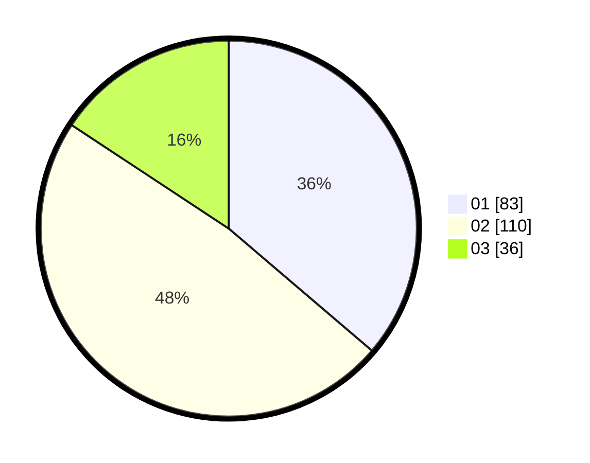

# Hasil

Hasil perolehan suara paslon dapat dilihat pada file paslon-01.txt, paslon-02.txt, dan paslon-03.txt.

Jika tidak ada, artinya data tersebut belum ada pada SIREKAP.

## Perolehan Suara

 * Paslon 01: **83**.
 * Paslon 02: **110**.
 * Paslon 03: **36**.

## Foto C Plano

https://sirekap-obj-formc.kpu.go.id/88dd/pemilu/ppwp/31/71/03/10/06/3171031006045-20240215-205211--8b3028c9-c0f1-4f15-9f65-5e4f8cc673de.jpg

https://sirekap-obj-formc.kpu.go.id/88dd/pemilu/ppwp/31/71/03/10/06/3171031006045-20240215-205214--17d5927b-fa0c-403e-9661-4c68beff4cf4.jpg

https://sirekap-obj-formc.kpu.go.id/88dd/pemilu/ppwp/31/71/03/10/06/3171031006045-20240215-205212--113c0863-975b-4737-99e7-721a7beb34c5.jpg

## DATA PEMILIH TETAP

Jumlah pemilih dalam DPT: **280**.
 * L: **143**.
 * P: **137**.

## DATA PENGGUNA HAK PILIH

Jumlah pengguna hak pilih dalam DPT: **233**.
 * L: **116**.
 * P: **117**.

Jumlah pengguna hak pilih dalam DPTb: **3**.
 * L: **1**.
 * P: **2**.

Jumlah pengguna hak pilih dalam DPK: **0**.
 * L: **0**.
 * P: **0**.

Jumlah pengguna hak pilih: **236**.
 * L: **117**.
 * P: **119**.

## JUMLAH SUARA SAH DAN TIDAK SAH

JUMLAH SELURUH SUARA SAH: **229**.

JUMLAH SUARA TIDAK SAH: **7**.

JUMLAH SELURUH SUARA SAH DAN SUARA TIDAK SAH: **236**.
