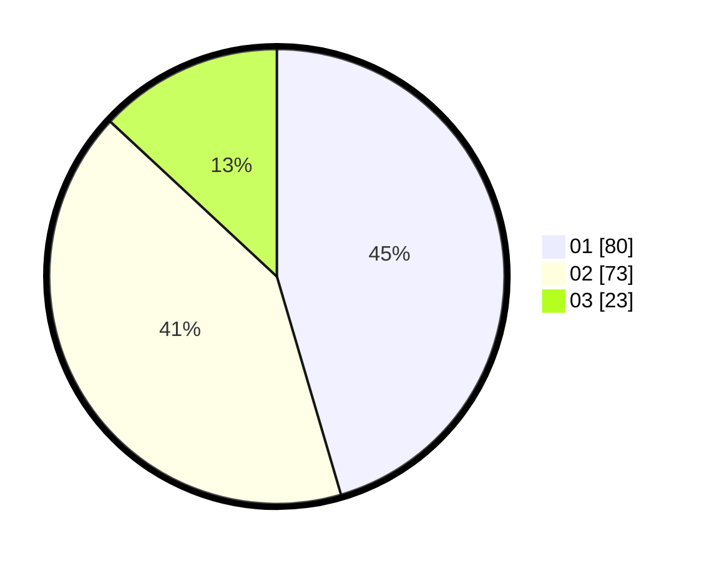

# Hasil

Hasil perolehan suara paslon dapat dilihat pada file paslon-01.txt, paslon-02.txt, dan paslon-03.txt.

Jika tidak ada, artinya data tersebut belum ada pada SIREKAP.

## Perolehan Suara

 * Paslon 01: **80**.
 * Paslon 02: **73**.
 * Paslon 03: **23**.

## Foto C Plano

https://sirekap-obj-formc.kpu.go.id/452f/pemilu/ppwp/31/71/03/10/06/3171031006048-20240215-234628--c55830cd-bc70-4cb1-9a1b-58cd006344aa.jpg

https://sirekap-obj-formc.kpu.go.id/452f/pemilu/ppwp/31/71/03/10/06/3171031006048-20240214-141026--afbc5c38-b7d8-4701-9e11-a59edef18cf1.jpg

https://sirekap-obj-formc.kpu.go.id/452f/pemilu/ppwp/31/71/03/10/06/3171031006048-20240214-141130--5625994c-197b-4bbd-bee7-05082590d370.jpg

## DATA PEMILIH TETAP

Jumlah pemilih dalam DPT: **259**.
 * L: **124**.
 * P: **135**.

## DATA PENGGUNA HAK PILIH

Jumlah pengguna hak pilih dalam DPT: **179**.
 * L: **81**.
 * P: **98**.

Jumlah pengguna hak pilih dalam DPTb: **0**.
 * L: **0**.
 * P: **0**.

Jumlah pengguna hak pilih dalam DPK: **0**.
 * L: **0**.
 * P: **0**.

Jumlah pengguna hak pilih: **179**.
 * L: **81**.
 * P: **98**.

## JUMLAH SUARA SAH DAN TIDAK SAH

JUMLAH SELURUH SUARA SAH: **176**.

JUMLAH SUARA TIDAK SAH: **3**.

JUMLAH SELURUH SUARA SAH DAN SUARA TIDAK SAH: **179**.
