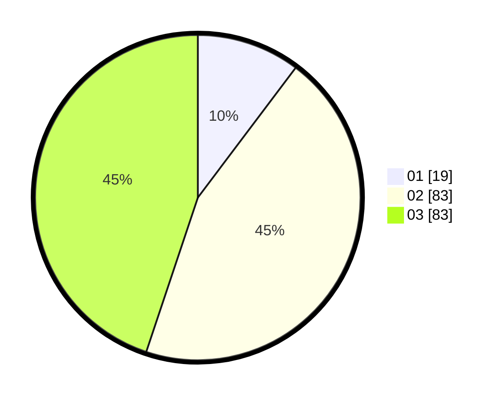

# Hasil

Hasil perolehan suara paslon dapat dilihat pada file paslon-01.txt, paslon-02.txt, dan paslon-03.txt.

Jika tidak ada, artinya data tersebut belum ada pada SIREKAP.

## Perolehan Suara

 * Paslon 01: **19**.
 * Paslon 02: **83**.
 * Paslon 03: **83**.

## Foto C Plano

https://sirekap-obj-formc.kpu.go.id/449e/pemilu/ppwp/31/71/03/10/06/3171031006051-20240216-005748--ffefa6eb-a364-437a-8b34-ca3ae4963650.jpg

https://sirekap-obj-formc.kpu.go.id/449e/pemilu/ppwp/31/71/03/10/06/3171031006051-20240216-005749--731b6a0b-2f85-47a3-b7ee-308d488a3f80.jpg

https://sirekap-obj-formc.kpu.go.id/449e/pemilu/ppwp/31/71/03/10/06/3171031006051-20240216-005748--b1a5c88a-ba52-4bf9-a95c-fa69fc04c24e.jpg

## DATA PEMILIH TETAP

Jumlah pemilih dalam DPT: **262**.
 * L: **124**.
 * P: **138**.

## DATA PENGGUNA HAK PILIH

Jumlah pengguna hak pilih dalam DPT: **183**.
 * L: **87**.
 * P: **96**.

Jumlah pengguna hak pilih dalam DPTb: **1**.
 * L: **1**.
 * P: **0**.

Jumlah pengguna hak pilih dalam DPK: **2**.
 * L: **1**.
 * P: **1**.

Jumlah pengguna hak pilih: **186**.
 * L: **88**.
 * P: **97**.

## JUMLAH SUARA SAH DAN TIDAK SAH

JUMLAH SELURUH SUARA SAH: **185**.

JUMLAH SUARA TIDAK SAH: **1**.

JUMLAH SELURUH SUARA SAH DAN SUARA TIDAK SAH: **186**.
