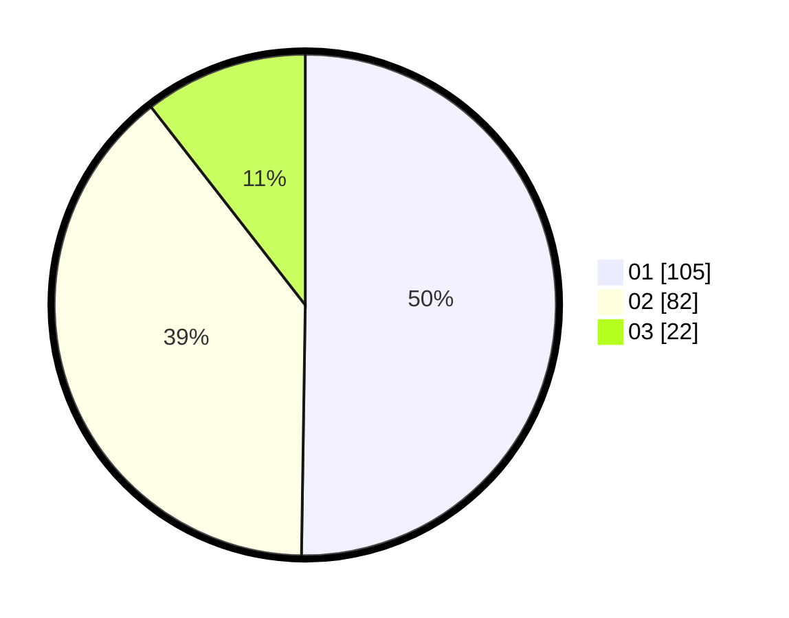

# Hasil

Hasil perolehan suara paslon dapat dilihat pada file paslon-01.txt, paslon-02.txt, dan paslon-03.txt.

Jika tidak ada, artinya data tersebut belum ada pada SIREKAP.

## Perolehan Suara

 * Paslon 01: **105**.
 * Paslon 02: **82**.
 * Paslon 03: **22**.

## Foto C Plano

https://sirekap-obj-formc.kpu.go.id/0fa8/pemilu/ppwp/31/71/03/10/06/3171031006060-20240216-151955--0f96a544-bcd1-4425-b3dc-6fe6eee04576.jpg

https://sirekap-obj-formc.kpu.go.id/0fa8/pemilu/ppwp/31/71/03/10/06/3171031006060-20240216-151956--1f1f036f-fdb9-485f-bf2f-e8536ee4c3f7.jpg

https://sirekap-obj-formc.kpu.go.id/0fa8/pemilu/ppwp/31/71/03/10/06/3171031006060-20240216-151956--bb19a5dd-d385-4771-a59c-d344600a6fc8.jpg

## DATA PEMILIH TETAP

Jumlah pemilih dalam DPT: **250**.
 * L: **115**.
 * P: **135**.

## DATA PENGGUNA HAK PILIH

Jumlah pengguna hak pilih dalam DPT: **205**.
 * L: **92**.
 * P: **113**.

Jumlah pengguna hak pilih dalam DPTb: **0**.
 * L: **0**.
 * P: **0**.

Jumlah pengguna hak pilih dalam DPK: **5**.
 * L: **2**.
 * P: **3**.

Jumlah pengguna hak pilih: **210**.
 * L: **94**.
 * P: **116**.

## JUMLAH SUARA SAH DAN TIDAK SAH

JUMLAH SELURUH SUARA SAH: **209**.

JUMLAH SUARA TIDAK SAH: **1**.

JUMLAH SELURUH SUARA SAH DAN SUARA TIDAK SAH: **210**.
