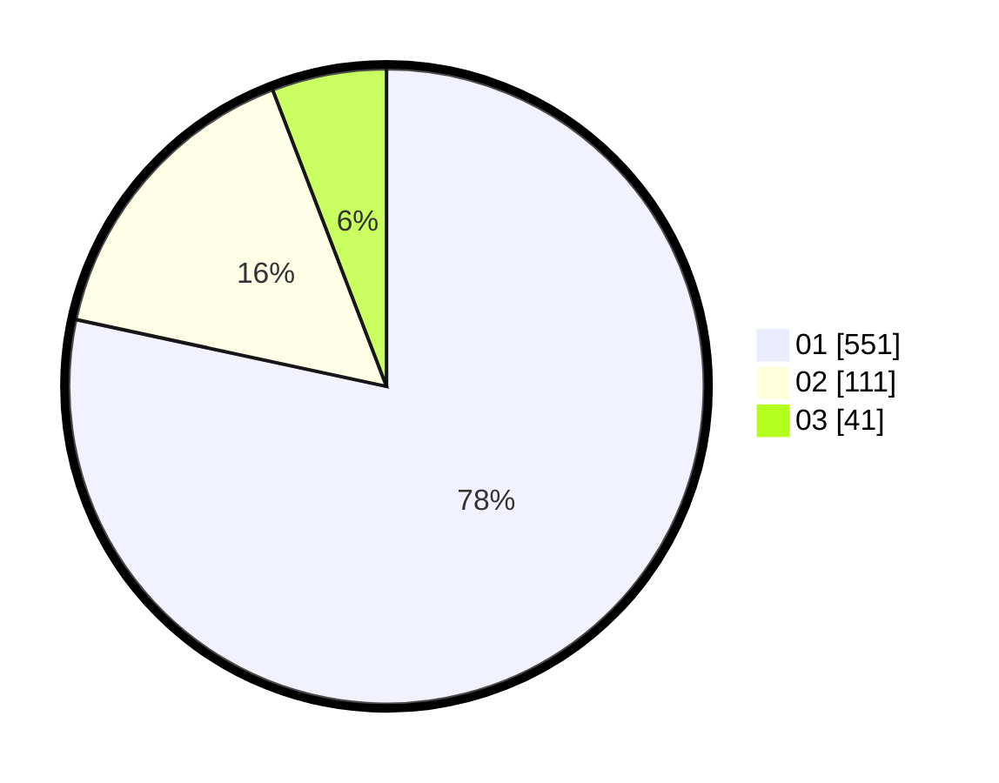

# Hasil

Hasil perolehan suara paslon dapat dilihat pada file paslon-01.txt, paslon-02.txt, dan paslon-03.txt.

Jika tidak ada, artinya data tersebut belum ada pada SIREKAP.

## Perolehan Suara

 * Paslon 01: **551**.
 * Paslon 02: **111**.
 * Paslon 03: **41**.

## Foto C Plano

https://sirekap-obj-formc.kpu.go.id/fe26/pemilu/ppwp/31/71/03/10/06/3171031006061-20240215-204711--c5096eb2-109f-47ff-97ca-ba3cbdc5bb91.jpg

https://sirekap-obj-formc.kpu.go.id/fe26/pemilu/ppwp/31/71/03/10/06/3171031006061-20240215-204714--71909c32-d696-47ab-97a1-f381fbd1d13c.jpg

https://sirekap-obj-formc.kpu.go.id/fe26/pemilu/ppwp/31/71/03/10/06/3171031006061-20240215-204714--598bf3b3-e417-4316-9ba3-8fa704ca38f5.jpg

## DATA PEMILIH TETAP

Jumlah pemilih dalam DPT: **181**.
 * L: **89**.
 * P: **92**.

## DATA PENGGUNA HAK PILIH

Jumlah pengguna hak pilih dalam DPT: **179**.
 * L: **87**.
 * P: **92**.

Jumlah pengguna hak pilih dalam DPTb: **1**.
 * L: **1**.
 * P: **0**.

Jumlah pengguna hak pilih dalam DPK: **1**.
 * L: **1**.
 * P: **0**.

Jumlah pengguna hak pilih: **181**.
 * L: **89**.
 * P: **92**.

## JUMLAH SUARA SAH DAN TIDAK SAH

JUMLAH SELURUH SUARA SAH: **178**.

JUMLAH SUARA TIDAK SAH: **3**.

JUMLAH SELURUH SUARA SAH DAN SUARA TIDAK SAH: **181**.
