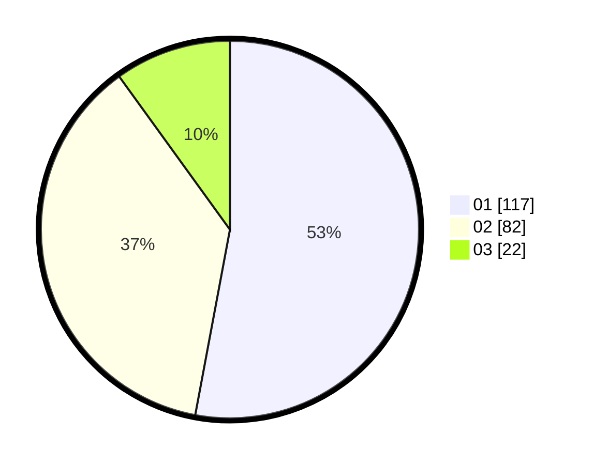

# Hasil

Hasil perolehan suara paslon dapat dilihat pada file paslon-01.txt, paslon-02.txt, dan paslon-03.txt.

Jika tidak ada, artinya data tersebut belum ada pada SIREKAP.

## Perolehan Suara

 * Paslon 01: **117**.
 * Paslon 02: **82**.
 * Paslon 03: **22**.

## Foto C Plano

https://sirekap-obj-formc.kpu.go.id/f699/pemilu/ppwp/31/71/03/10/06/3171031006065-20240216-155917--2097db91-217b-40e2-baed-869addea166d.jpg

https://sirekap-obj-formc.kpu.go.id/f699/pemilu/ppwp/31/71/03/10/06/3171031006065-20240214-185339--5317eed3-bdd0-449b-b8a5-86b2f7bb7f0f.jpg

https://sirekap-obj-formc.kpu.go.id/f699/pemilu/ppwp/31/71/03/10/06/3171031006065-20240214-185348--602cf02d-7219-4d9e-b292-efe6c4025753.jpg

## DATA PEMILIH TETAP

Jumlah pemilih dalam DPT: **286**.
 * L: **133**.
 * P: **153**.

## DATA PENGGUNA HAK PILIH

Jumlah pengguna hak pilih dalam DPT: **224**.
 * L: **96**.
 * P: **128**.

Jumlah pengguna hak pilih dalam DPTb: **0**.
 * L: **0**.
 * P: **0**.

Jumlah pengguna hak pilih dalam DPK: **1**.
 * L: **0**.
 * P: **1**.

Jumlah pengguna hak pilih: **225**.
 * L: **96**.
 * P: **129**.

## JUMLAH SUARA SAH DAN TIDAK SAH

JUMLAH SELURUH SUARA SAH: **221**.

JUMLAH SUARA TIDAK SAH: **4**.

JUMLAH SELURUH SUARA SAH DAN SUARA TIDAK SAH: **225**.
