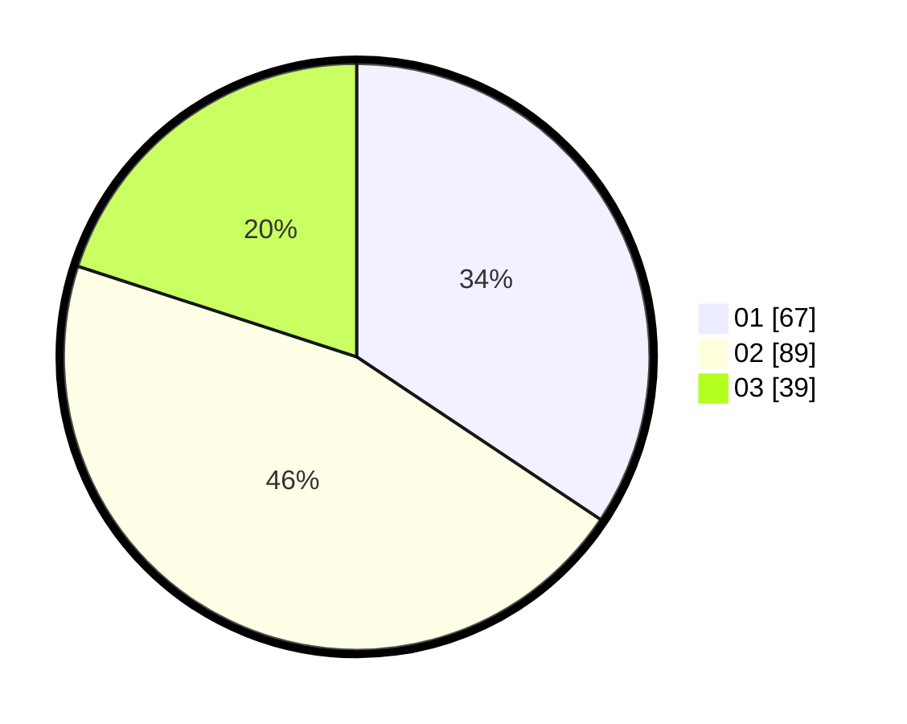

# Hasil

Hasil perolehan suara paslon dapat dilihat pada file paslon-01.txt, paslon-02.txt, dan paslon-03.txt.

Jika tidak ada, artinya data tersebut belum ada pada SIREKAP.

## Perolehan Suara

 * Paslon 01: **67**.
 * Paslon 02: **89**.
 * Paslon 03: **39**.

## Foto C Plano

https://sirekap-obj-formc.kpu.go.id/b057/pemilu/ppwp/31/71/03/10/06/3171031006069-20240217-232704--b39a7542-af54-4318-9e62-0f7e43b5984e.jpg

https://sirekap-obj-formc.kpu.go.id/b057/pemilu/ppwp/31/71/03/10/06/3171031006069-20240217-232706--654b7a08-1a2b-460a-8f20-f027d931688d.jpg

https://sirekap-obj-formc.kpu.go.id/b057/pemilu/ppwp/31/71/03/10/06/3171031006069-20240217-232705--c34e92a3-3b55-49cb-b3c8-d859f51e9f7b.jpg

## DATA PEMILIH TETAP

Jumlah pemilih dalam DPT: **193**.
 * L: **91**.
 * P: **102**.

## DATA PENGGUNA HAK PILIH

Jumlah pengguna hak pilih dalam DPT: **193**.
 * L: **91**.
 * P: **102**.

Jumlah pengguna hak pilih dalam DPTb: **3**.
 * L: **1**.
 * P: **2**.

Jumlah pengguna hak pilih dalam DPK: **0**.
 * L: **0**.
 * P: **0**.

Jumlah pengguna hak pilih: **196**.
 * L: **92**.
 * P: **104**.

## JUMLAH SUARA SAH DAN TIDAK SAH

JUMLAH SELURUH SUARA SAH: **195**.

JUMLAH SUARA TIDAK SAH: **1**.

JUMLAH SELURUH SUARA SAH DAN SUARA TIDAK SAH: **196**.
