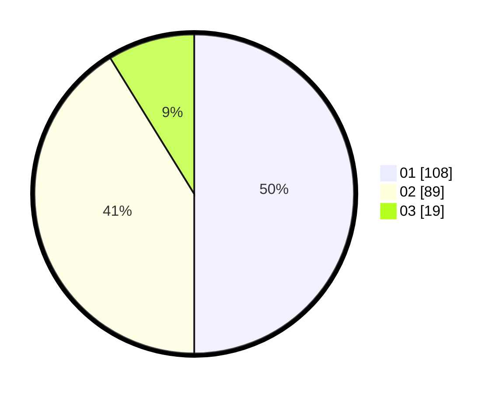

# Hasil

Hasil perolehan suara paslon dapat dilihat pada file paslon-01.txt, paslon-02.txt, dan paslon-03.txt.

Jika tidak ada, artinya data tersebut belum ada pada SIREKAP.

## Perolehan Suara

 * Paslon 01: **108**.
 * Paslon 02: **89**.
 * Paslon 03: **19**.

## Foto C Plano

https://sirekap-obj-formc.kpu.go.id/ce54/pemilu/ppwp/31/71/03/10/06/3171031006074-20240214-192028--b0e05bac-c69f-4044-8f57-c00def37da0d.jpg

https://sirekap-obj-formc.kpu.go.id/ce54/pemilu/ppwp/31/71/03/10/06/3171031006074-20240214-192034--ebc973c0-087d-4f37-b5e4-a95f32142b12.jpg

https://sirekap-obj-formc.kpu.go.id/ce54/pemilu/ppwp/31/71/03/10/06/3171031006074-20240214-204635--d75b568e-3bb1-4134-a4af-8f7fd8372e35.jpg
