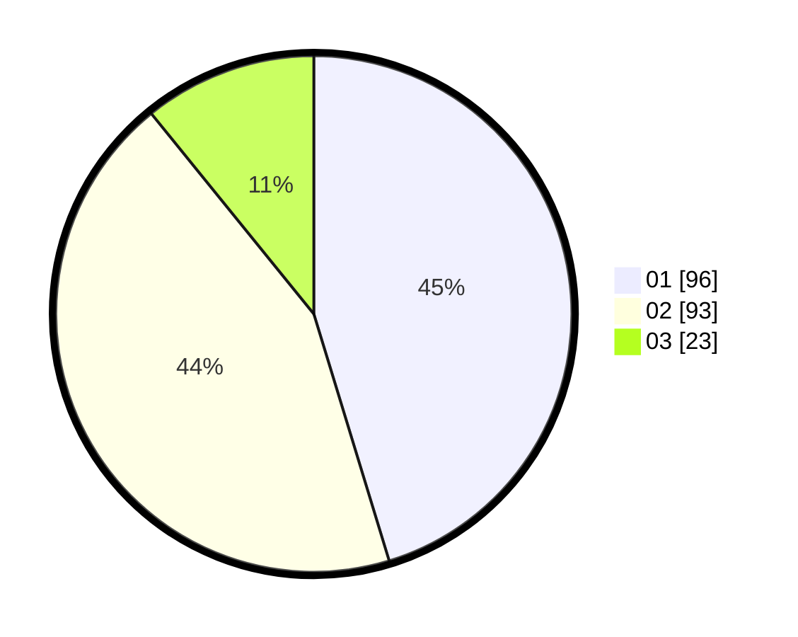

# Hasil

Hasil perolehan suara paslon dapat dilihat pada file paslon-01.txt, paslon-02.txt, dan paslon-03.txt.

Jika tidak ada, artinya data tersebut belum ada pada SIREKAP.

## Perolehan Suara

 * Paslon 01: **96**.
 * Paslon 02: **93**.
 * Paslon 03: **23**.

## Foto C Plano

https://sirekap-obj-formc.kpu.go.id/b7a1/pemilu/ppwp/31/71/03/10/06/3171031006075-20240214-214636--b933041b-89f8-4a62-9ed2-1953b85585b0.jpg

https://sirekap-obj-formc.kpu.go.id/b7a1/pemilu/ppwp/31/71/03/10/06/3171031006075-20240214-191316--da58e80a-3702-4c95-9974-57f6bce99690.jpg

https://sirekap-obj-formc.kpu.go.id/b7a1/pemilu/ppwp/31/71/03/10/06/3171031006075-20240214-191514--11323cd2-1506-4d56-a572-2ea0f339b650.jpg
