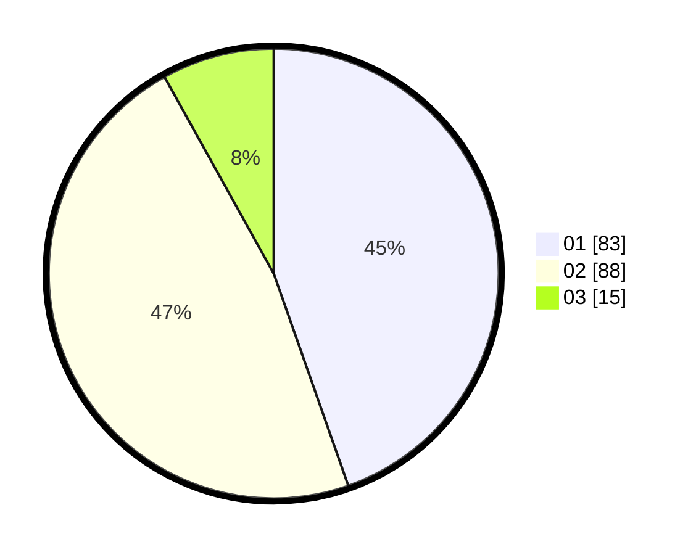

# Hasil

Hasil perolehan suara paslon dapat dilihat pada file paslon-01.txt, paslon-02.txt, dan paslon-03.txt.

Jika tidak ada, artinya data tersebut belum ada pada SIREKAP.

## Perolehan Suara

 * Paslon 01: **83**.
 * Paslon 02: **88**.
 * Paslon 03: **15**.

## Foto C Plano

https://sirekap-obj-formc.kpu.go.id/1141/pemilu/ppwp/31/71/03/10/06/3171031006076-20240215-010812--05c3f652-0eba-4de9-9ad3-1f5a928537bb.jpg

https://sirekap-obj-formc.kpu.go.id/1141/pemilu/ppwp/31/71/03/10/06/3171031006076-20240215-014835--6565eafa-f511-435b-a6f8-b8757defa018.jpg

https://sirekap-obj-formc.kpu.go.id/1141/pemilu/ppwp/31/71/03/10/06/3171031006076-20240215-010955--5abaf7f4-a927-4da9-a278-4d351b449635.jpg

## DATA PEMILIH TETAP

Jumlah pemilih dalam DPT: **277**.
 * L: **127**.
 * P: **150**.

## DATA PENGGUNA HAK PILIH

Jumlah pengguna hak pilih dalam DPT: **186**.
 * L: **81**.
 * P: **105**.

Jumlah pengguna hak pilih dalam DPTb: **2**.
 * L: **2**.
 * P: **0**.

Jumlah pengguna hak pilih dalam DPK: **0**.
 * L: **0**.
 * P: **0**.

Jumlah pengguna hak pilih: **188**.
 * L: **83**.
 * P: **105**.

## JUMLAH SUARA SAH DAN TIDAK SAH

JUMLAH SELURUH SUARA SAH: **186**.

JUMLAH SUARA TIDAK SAH: **2**.

JUMLAH SELURUH SUARA SAH DAN SUARA TIDAK SAH: **188**.
