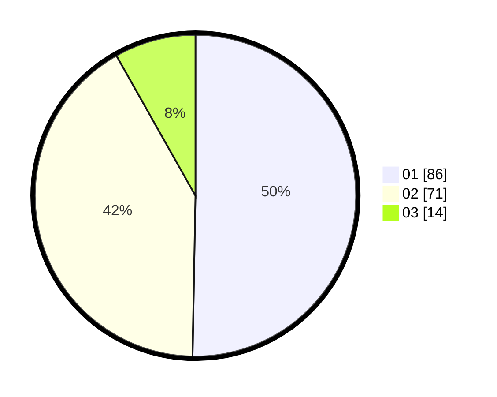

# Hasil

Hasil perolehan suara paslon dapat dilihat pada file paslon-01.txt, paslon-02.txt, dan paslon-03.txt.

Jika tidak ada, artinya data tersebut belum ada pada SIREKAP.

## Perolehan Suara

 * Paslon 01: **86**.
 * Paslon 02: **71**.
 * Paslon 03: **14**.

## Foto C Plano

https://sirekap-obj-formc.kpu.go.id/bbd1/pemilu/ppwp/31/71/03/10/06/3171031006077-20240215-163839--3a8779c5-386b-440f-a773-37ca486c31e7.jpg

https://sirekap-obj-formc.kpu.go.id/bbd1/pemilu/ppwp/31/71/03/10/06/3171031006077-20240215-034605--849978dd-d6a3-42f3-a855-d49020f9a181.jpg

https://sirekap-obj-formc.kpu.go.id/bbd1/pemilu/ppwp/31/71/03/10/06/3171031006077-20240215-034704--f8c9a3ef-58ee-40c4-8c85-ef1cdae6b4dc.jpg
