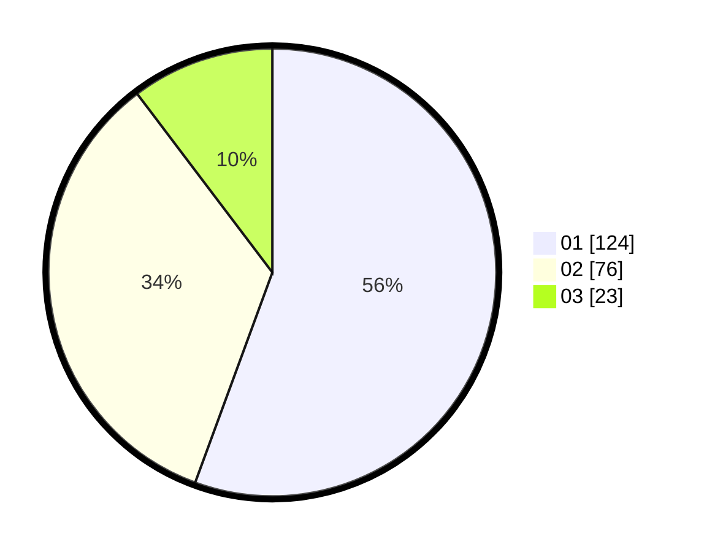

# Hasil

Hasil perolehan suara paslon dapat dilihat pada file paslon-01.txt, paslon-02.txt, dan paslon-03.txt.

Jika tidak ada, artinya data tersebut belum ada pada SIREKAP.

## Perolehan Suara

 * Paslon 01: **124**.
 * Paslon 02: **76**.
 * Paslon 03: **23**.

## Foto C Plano

https://sirekap-obj-formc.kpu.go.id/e285/pemilu/ppwp/31/71/03/10/06/3171031006079-20240216-185643--8fac561e-bfc1-4957-b0ef-e648db74d050.jpg

https://sirekap-obj-formc.kpu.go.id/e285/pemilu/ppwp/31/71/03/10/06/3171031006079-20240216-191442--44270743-475d-40c2-8bb1-8a6c970afddf.jpg

https://sirekap-obj-formc.kpu.go.id/e285/pemilu/ppwp/31/71/03/10/06/3171031006079-20240216-190111--8b588e9f-9d8f-41df-b343-0bfd9f59a4e3.jpg

## DATA PEMILIH TETAP

Jumlah pemilih dalam DPT: **288**.
 * L: **150**.
 * P: **138**.

## DATA PENGGUNA HAK PILIH

Jumlah pengguna hak pilih dalam DPT: **219**.
 * L: **117**.
 * P: **102**.

Jumlah pengguna hak pilih dalam DPTb: **1**.
 * L: **1**.
 * P: **0**.

Jumlah pengguna hak pilih dalam DPK: **5**.
 * L: **3**.
 * P: **2**.

Jumlah pengguna hak pilih: **225**.
 * L: **121**.
 * P: **104**.

## JUMLAH SUARA SAH DAN TIDAK SAH

JUMLAH SELURUH SUARA SAH: **223**.

JUMLAH SUARA TIDAK SAH: **2**.

JUMLAH SELURUH SUARA SAH DAN SUARA TIDAK SAH: **225**.
