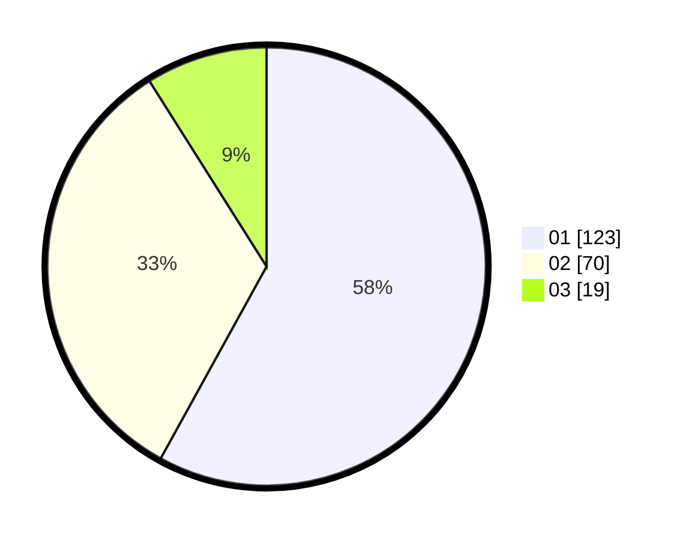

# Hasil

Hasil perolehan suara paslon dapat dilihat pada file paslon-01.txt, paslon-02.txt, dan paslon-03.txt.

Jika tidak ada, artinya data tersebut belum ada pada SIREKAP.

## Perolehan Suara

 * Paslon 01: **123**.
 * Paslon 02: **70**.
 * Paslon 03: **19**.

## Foto C Plano

https://sirekap-obj-formc.kpu.go.id/aa4e/pemilu/ppwp/31/71/03/10/06/3171031006081-20240216-141954--d38391e8-2cb4-4be1-ab7a-a92badc53cc2.jpg

https://sirekap-obj-formc.kpu.go.id/aa4e/pemilu/ppwp/31/71/03/10/06/3171031006081-20240216-141955--25887318-9eaa-40b7-ab96-222b1fe60972.jpg

https://sirekap-obj-formc.kpu.go.id/aa4e/pemilu/ppwp/31/71/03/10/06/3171031006081-20240216-141954--ad23c6db-2ccb-4876-a45c-89d753eb0a4b.jpg

## DATA PEMILIH TETAP

Jumlah pemilih dalam DPT: **216**.
 * L: **106**.
 * P: **110**.

## DATA PENGGUNA HAK PILIH

Jumlah pengguna hak pilih dalam DPT: **281**.
 * L: **146**.
 * P: **135**.

Jumlah pengguna hak pilih dalam DPTb: **0**.
 * L: **0**.
 * P: **0**.

Jumlah pengguna hak pilih dalam DPK: **0**.
 * L: **0**.
 * P: **0**.

Jumlah pengguna hak pilih: **281**.
 * L: **146**.
 * P: **135**.

## JUMLAH SUARA SAH DAN TIDAK SAH

JUMLAH SELURUH SUARA SAH: **212**.

JUMLAH SUARA TIDAK SAH: **4**.

JUMLAH SELURUH SUARA SAH DAN SUARA TIDAK SAH: **216**.
