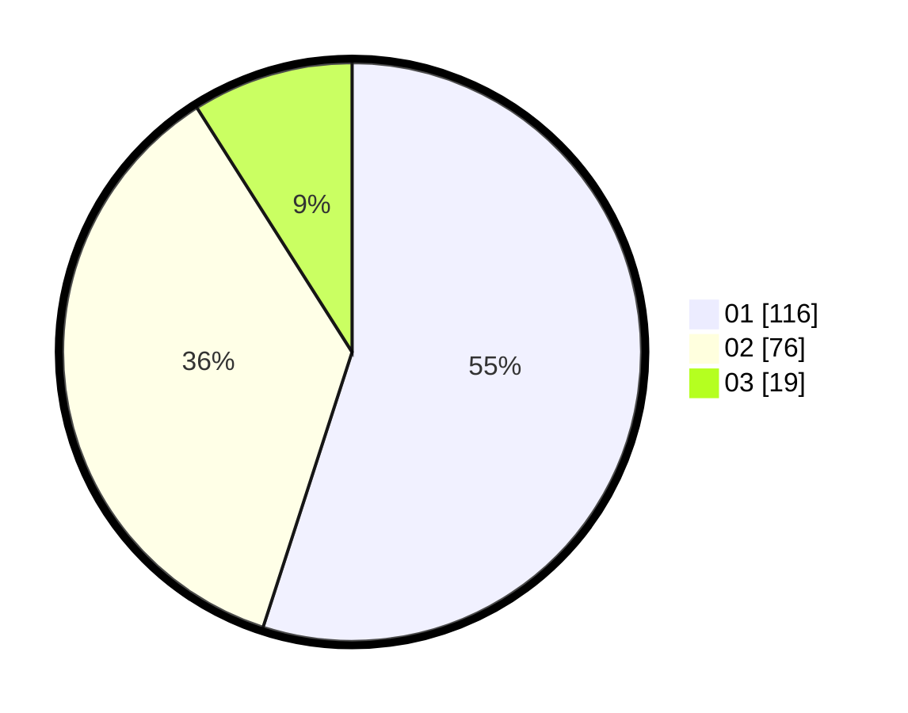

# Hasil

Hasil perolehan suara paslon dapat dilihat pada file paslon-01.txt, paslon-02.txt, dan paslon-03.txt.

Jika tidak ada, artinya data tersebut belum ada pada SIREKAP.

## Perolehan Suara

 * Paslon 01: **116**.
 * Paslon 02: **76**.
 * Paslon 03: **19**.

## Foto C Plano

https://sirekap-obj-formc.kpu.go.id/3600/pemilu/ppwp/31/71/03/10/06/3171031006082-20240214-200135--e4a1a145-7711-4a73-9338-42bc2c89493c.jpg

https://sirekap-obj-formc.kpu.go.id/3600/pemilu/ppwp/31/71/03/10/06/3171031006082-20240214-200301--2ff294aa-70bd-4306-881f-d4e87e9e6abc.jpg

https://sirekap-obj-formc.kpu.go.id/3600/pemilu/ppwp/31/71/03/10/06/3171031006082-20240214-200443--b01fd283-66b5-4438-aaea-cdf524f90309.jpg

## DATA PEMILIH TETAP

Jumlah pemilih dalam DPT: **282**.
 * L: **144**.
 * P: **138**.

## DATA PENGGUNA HAK PILIH

Jumlah pengguna hak pilih dalam DPT: **210**.
 * L: **98**.
 * P: **112**.

Jumlah pengguna hak pilih dalam DPTb: **1**.
 * L: **0**.
 * P: **1**.

Jumlah pengguna hak pilih dalam DPK: **4**.
 * L: **2**.
 * P: **2**.

Jumlah pengguna hak pilih: **215**.
 * L: **100**.
 * P: **115**.

## JUMLAH SUARA SAH DAN TIDAK SAH

JUMLAH SELURUH SUARA SAH: **211**.

JUMLAH SUARA TIDAK SAH: **4**.

JUMLAH SELURUH SUARA SAH DAN SUARA TIDAK SAH: **215**.
