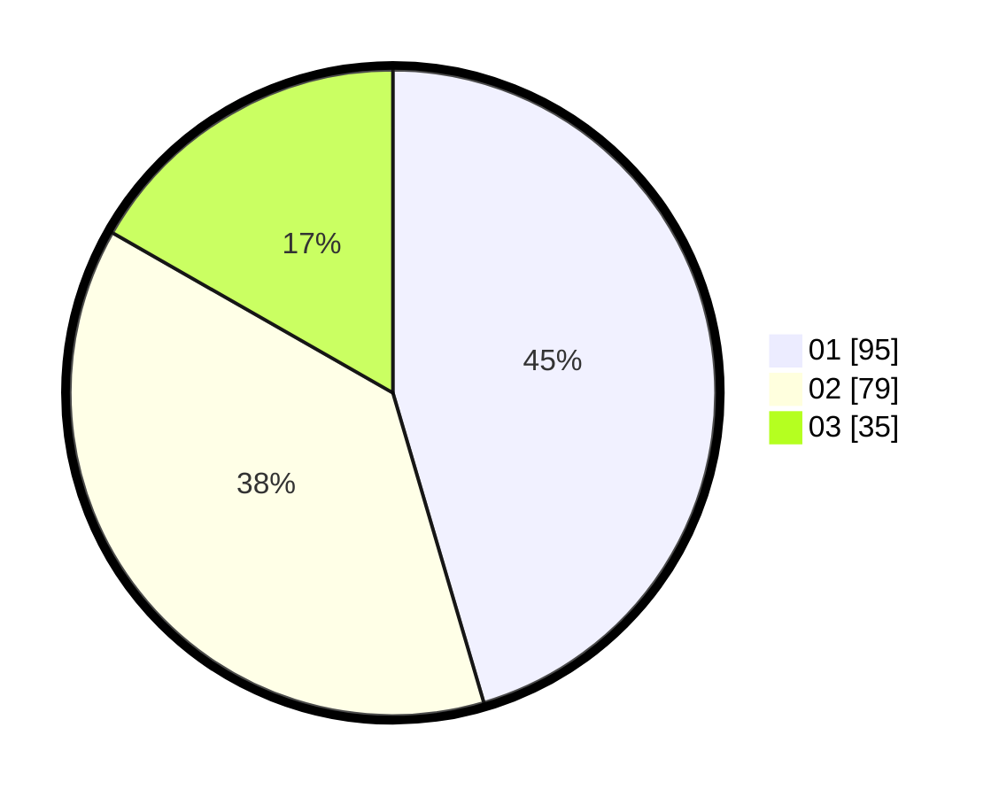

# Hasil

Hasil perolehan suara paslon dapat dilihat pada file paslon-01.txt, paslon-02.txt, dan paslon-03.txt.

Jika tidak ada, artinya data tersebut belum ada pada SIREKAP.

## Perolehan Suara

 * Paslon 01: **95**.
 * Paslon 02: **79**.
 * Paslon 03: **35**.

## Foto C Plano

https://sirekap-obj-formc.kpu.go.id/59b9/pemilu/ppwp/31/71/03/10/06/3171031006085-20240215-211916--c90ec809-d29f-404e-8523-2b48feca481a.jpg

https://sirekap-obj-formc.kpu.go.id/59b9/pemilu/ppwp/31/71/03/10/06/3171031006085-20240215-211918--97146269-60d1-4b36-957a-2d13976146f9.jpg

https://sirekap-obj-formc.kpu.go.id/59b9/pemilu/ppwp/31/71/03/10/06/3171031006085-20240215-211916--3f8287e9-9163-40c7-8552-399e4442f79a.jpg

## DATA PEMILIH TETAP

Jumlah pemilih dalam DPT: **280**.
 * L: **142**.
 * P: **138**.

## DATA PENGGUNA HAK PILIH

Jumlah pengguna hak pilih dalam DPT: **211**.
 * L: **100**.
 * P: **111**.

Jumlah pengguna hak pilih dalam DPTb: **3**.
 * L: **1**.
 * P: **2**.

Jumlah pengguna hak pilih dalam DPK: **0**.
 * L: **0**.
 * P: **0**.

Jumlah pengguna hak pilih: **214**.
 * L: **101**.
 * P: **113**.

## JUMLAH SUARA SAH DAN TIDAK SAH

JUMLAH SELURUH SUARA SAH: **209**.

JUMLAH SUARA TIDAK SAH: **5**.

JUMLAH SELURUH SUARA SAH DAN SUARA TIDAK SAH: **214**.
