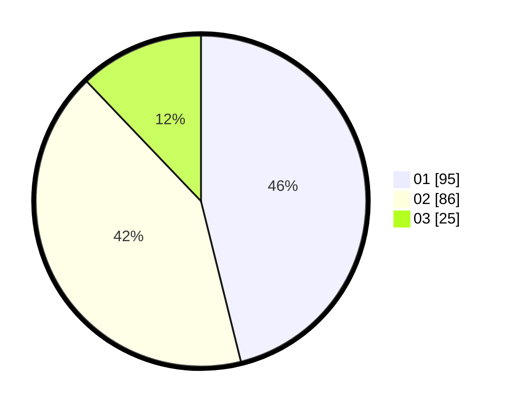

# Hasil

Hasil perolehan suara paslon dapat dilihat pada file paslon-01.txt, paslon-02.txt, dan paslon-03.txt.

Jika tidak ada, artinya data tersebut belum ada pada SIREKAP.

## Perolehan Suara

 * Paslon 01: **95**.
 * Paslon 02: **86**.
 * Paslon 03: **25**.

## Foto C Plano

https://sirekap-obj-formc.kpu.go.id/f825/pemilu/ppwp/31/71/03/10/06/3171031006087-20240215-003346--d1798ecc-3a31-46f3-a025-69f3aedd4765.jpg

https://sirekap-obj-formc.kpu.go.id/f825/pemilu/ppwp/31/71/03/10/06/3171031006087-20240214-224545--c8ddc45b-5a77-4ee0-ab1d-0fbc882224fd.jpg

https://sirekap-obj-formc.kpu.go.id/f825/pemilu/ppwp/31/71/03/10/06/3171031006087-20240214-224523--78637abf-8974-435c-aaba-3e29930af481.jpg
