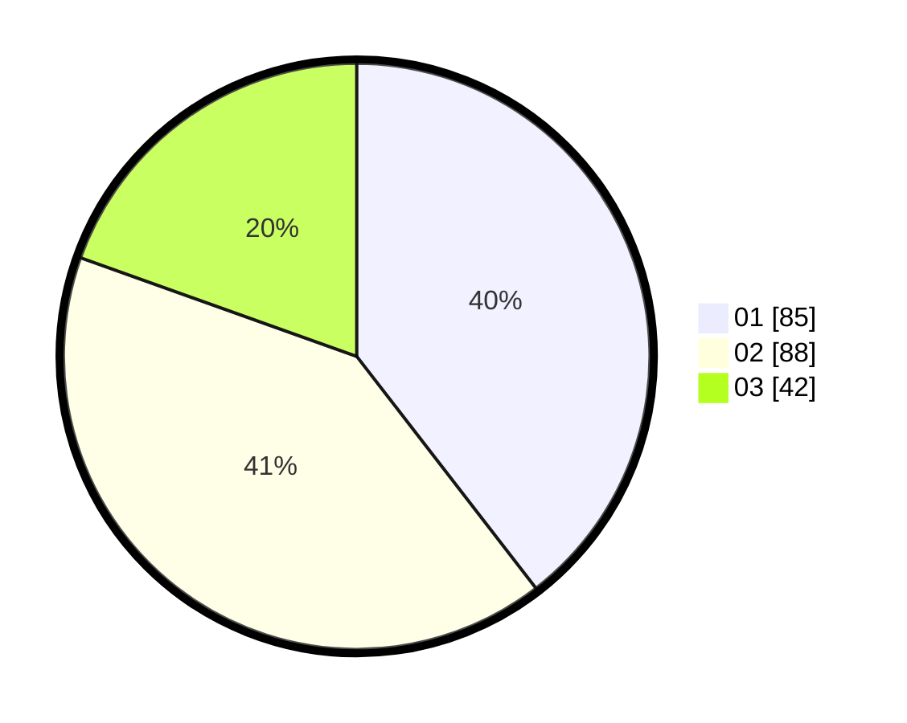

# Hasil

Hasil perolehan suara paslon dapat dilihat pada file paslon-01.txt, paslon-02.txt, dan paslon-03.txt.

Jika tidak ada, artinya data tersebut belum ada pada SIREKAP.

## Perolehan Suara

 * Paslon 01: **85**.
 * Paslon 02: **88**.
 * Paslon 03: **42**.

## Foto C Plano

https://sirekap-obj-formc.kpu.go.id/759f/pemilu/ppwp/31/71/03/10/06/3171031006088-20240215-002901--506a7962-c738-4477-9583-2a7b057cb6ed.jpg

https://sirekap-obj-formc.kpu.go.id/759f/pemilu/ppwp/31/71/03/10/06/3171031006088-20240215-002952--cf2414b3-cf72-433b-8f8e-019f01ebd53f.jpg

https://sirekap-obj-formc.kpu.go.id/759f/pemilu/ppwp/31/71/03/10/06/3171031006088-20240215-003031--e2471c3d-37cd-4129-bb54-5204ce1212f5.jpg
