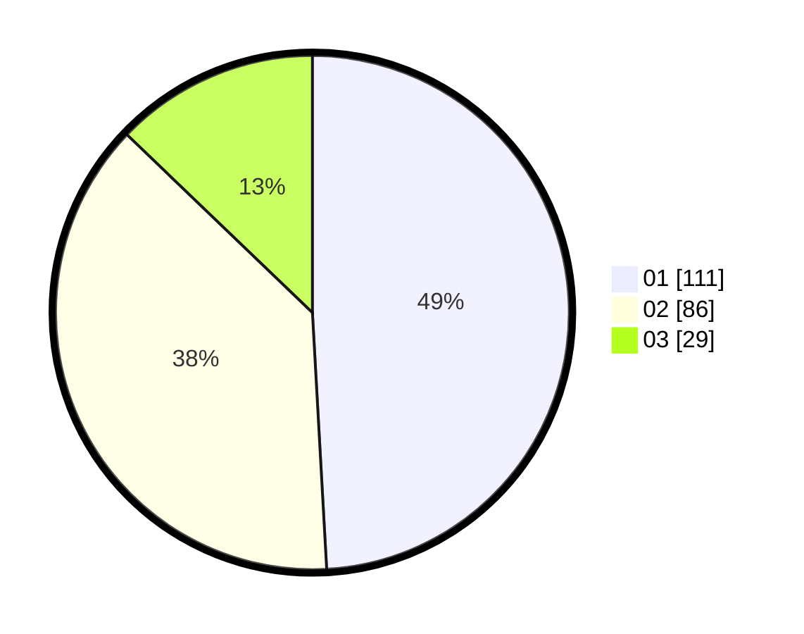

# Hasil

Hasil perolehan suara paslon dapat dilihat pada file paslon-01.txt, paslon-02.txt, dan paslon-03.txt.

Jika tidak ada, artinya data tersebut belum ada pada SIREKAP.

## Perolehan Suara

 * Paslon 01: **111**.
 * Paslon 02: **86**.
 * Paslon 03: **29**.

## Foto C Plano

https://sirekap-obj-formc.kpu.go.id/5446/pemilu/ppwp/31/71/03/10/06/3171031006089-20240214-223817--da7cd54b-23ac-4063-ae7a-4c89aecd6b3f.jpg

https://sirekap-obj-formc.kpu.go.id/5446/pemilu/ppwp/31/71/03/10/06/3171031006089-20240214-205612--a79daeba-d253-426d-8835-f91459f2a609.jpg

https://sirekap-obj-formc.kpu.go.id/5446/pemilu/ppwp/31/71/03/10/06/3171031006089-20240214-205825--a658dd60-525e-4931-b27f-1851f9935c08.jpg
