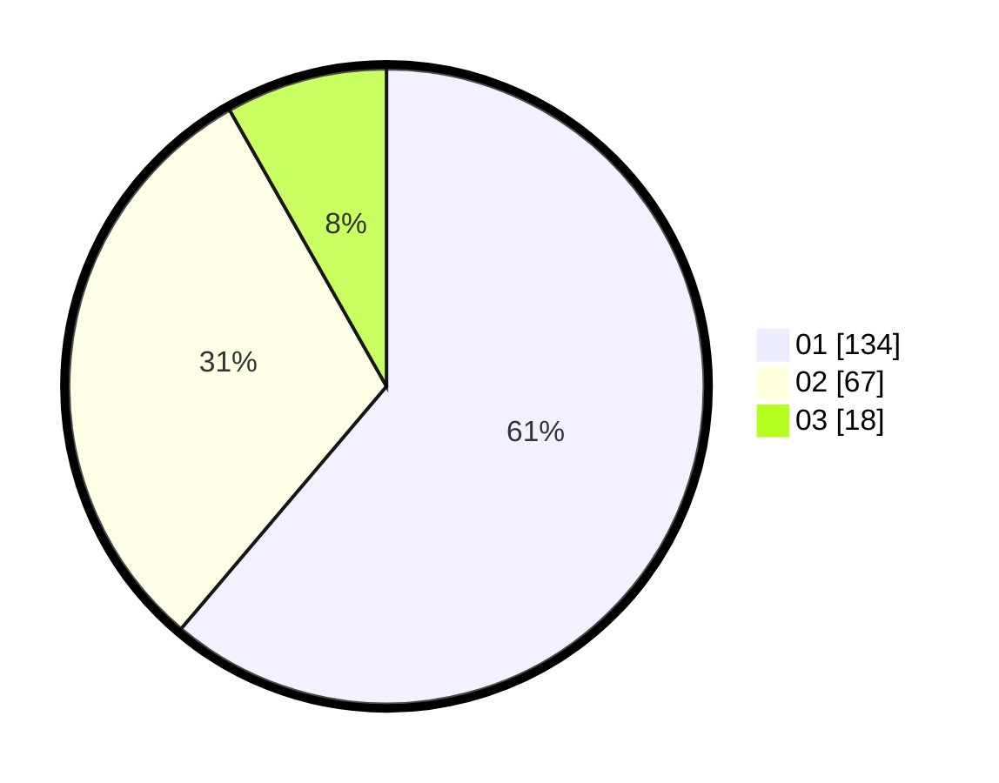

# Hasil

Hasil perolehan suara paslon dapat dilihat pada file paslon-01.txt, paslon-02.txt, dan paslon-03.txt.

Jika tidak ada, artinya data tersebut belum ada pada SIREKAP.

## Perolehan Suara

 * Paslon 01: **134**.
 * Paslon 02: **67**.
 * Paslon 03: **18**.

## Foto C Plano

https://sirekap-obj-formc.kpu.go.id/b3fa/pemilu/ppwp/31/71/03/10/06/3171031006092-20240216-212054--654aef30-98bb-4a98-a496-2adb78a06123.jpg

https://sirekap-obj-formc.kpu.go.id/b3fa/pemilu/ppwp/31/71/03/10/06/3171031006092-20240216-212055--bd4d3138-36d4-4e33-a89f-efef2fe9a2a5.jpg

https://sirekap-obj-formc.kpu.go.id/b3fa/pemilu/ppwp/31/71/03/10/06/3171031006092-20240216-212055--8f9119f0-f1d5-4ee1-b547-d38ddac7d7d7.jpg

## DATA PEMILIH TETAP

Jumlah pemilih dalam DPT: **0**.
 * L: **0**.
 * P: **0**.

## DATA PENGGUNA HAK PILIH

Jumlah pengguna hak pilih dalam DPT: **0**.
 * L: **0**.
 * P: **0**.

Jumlah pengguna hak pilih dalam DPTb: **0**.
 * L: **0**.
 * P: **0**.

Jumlah pengguna hak pilih dalam DPK: **0**.
 * L: **0**.
 * P: **0**.

Jumlah pengguna hak pilih: **0**.
 * L: **0**.
 * P: **0**.

## JUMLAH SUARA SAH DAN TIDAK SAH

JUMLAH SELURUH SUARA SAH: **219**.

JUMLAH SUARA TIDAK SAH: **2**.

JUMLAH SELURUH SUARA SAH DAN SUARA TIDAK SAH: **221**.
