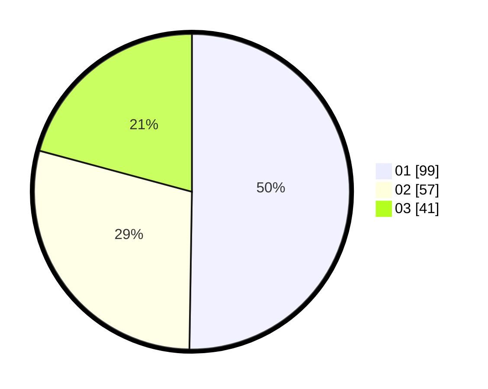

# Hasil

Hasil perolehan suara paslon dapat dilihat pada file paslon-01.txt, paslon-02.txt, dan paslon-03.txt.

Jika tidak ada, artinya data tersebut belum ada pada SIREKAP.

## Perolehan Suara

 * Paslon 01: **99**.
 * Paslon 02: **57**.
 * Paslon 03: **41**.

## Foto C Plano

https://sirekap-obj-formc.kpu.go.id/0eb3/pemilu/ppwp/31/71/03/10/06/3171031006096-20240214-192133--fe9787bf-470e-4957-aae9-643d6d3997a9.jpg

https://sirekap-obj-formc.kpu.go.id/0eb3/pemilu/ppwp/31/71/03/10/06/3171031006096-20240217-144930--ea66fb84-5b82-4baf-8820-e437785b6596.jpg

https://sirekap-obj-formc.kpu.go.id/0eb3/pemilu/ppwp/31/71/03/10/06/3171031006096-20240217-144704--b97e9344-8820-40b9-9cac-ec72357256be.jpg

## DATA PEMILIH TETAP

Jumlah pemilih dalam DPT: **262**.
 * L: **125**.
 * P: **137**.

## DATA PENGGUNA HAK PILIH

Jumlah pengguna hak pilih dalam DPT: **196**.
 * L: **91**.
 * P: **105**.

Jumlah pengguna hak pilih dalam DPTb: **6**.
 * L: **3**.
 * P: **3**.

Jumlah pengguna hak pilih dalam DPK: **2**.
 * L: **1**.
 * P: **1**.

Jumlah pengguna hak pilih: **204**.
 * L: **95**.
 * P: **109**.

## JUMLAH SUARA SAH DAN TIDAK SAH

JUMLAH SELURUH SUARA SAH: **197**.

JUMLAH SUARA TIDAK SAH: **7**.

JUMLAH SELURUH SUARA SAH DAN SUARA TIDAK SAH: **204**.
