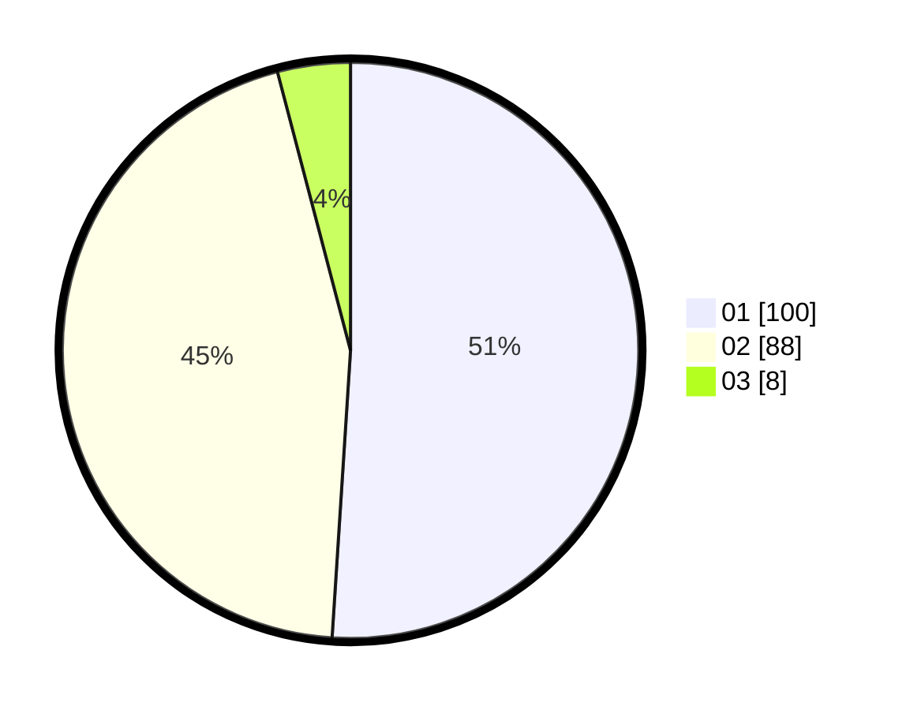

# Hasil

Hasil perolehan suara paslon dapat dilihat pada file paslon-01.txt, paslon-02.txt, dan paslon-03.txt.

Jika tidak ada, artinya data tersebut belum ada pada SIREKAP.

## Perolehan Suara

 * Paslon 01: **100**.
 * Paslon 02: **88**.
 * Paslon 03: **8**.

## Foto C Plano

https://sirekap-obj-formc.kpu.go.id/1e35/pemilu/ppwp/31/71/03/10/06/3171031006098-20240216-152411--ad564e1f-305d-40d3-88e0-c81a6c49b1a0.jpg

https://sirekap-obj-formc.kpu.go.id/1e35/pemilu/ppwp/31/71/03/10/06/3171031006098-20240216-152412--ecb9dc9d-3429-401b-9f67-3ce86fb91fa2.jpg

https://sirekap-obj-formc.kpu.go.id/1e35/pemilu/ppwp/31/71/03/10/06/3171031006098-20240216-152412--962a2491-ad86-4b90-b81a-9d2313684477.jpg

## DATA PEMILIH TETAP

Jumlah pemilih dalam DPT: **258**.
 * L: **132**.
 * P: **126**.

## DATA PENGGUNA HAK PILIH

Jumlah pengguna hak pilih dalam DPT: **197**.
 * L: **95**.
 * P: **102**.

Jumlah pengguna hak pilih dalam DPTb: **4**.
 * L: **2**.
 * P: **2**.

Jumlah pengguna hak pilih dalam DPK: **0**.
 * L: **0**.
 * P: **0**.

Jumlah pengguna hak pilih: **201**.
 * L: **97**.
 * P: **104**.

## JUMLAH SUARA SAH DAN TIDAK SAH

JUMLAH SELURUH SUARA SAH: **196**.

JUMLAH SUARA TIDAK SAH: **5**.

JUMLAH SELURUH SUARA SAH DAN SUARA TIDAK SAH: **201**.
