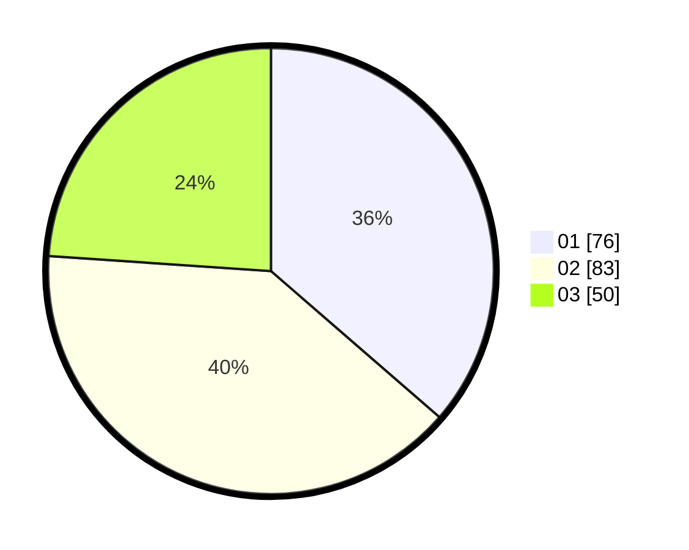

# Hasil

Hasil perolehan suara paslon dapat dilihat pada file paslon-01.txt, paslon-02.txt, dan paslon-03.txt.

Jika tidak ada, artinya data tersebut belum ada pada SIREKAP.

## Perolehan Suara

 * Paslon 01: **76**.
 * Paslon 02: **83**.
 * Paslon 03: **50**.

## Foto C Plano

https://sirekap-obj-formc.kpu.go.id/4114/pemilu/ppwp/31/71/03/10/06/3171031006100-20240215-214636--fbfbb986-da72-4f35-b68d-94870201bd3c.jpg

https://sirekap-obj-formc.kpu.go.id/4114/pemilu/ppwp/31/71/03/10/06/3171031006100-20240215-214639--55989f91-400c-4703-ae9e-05551c78ca03.jpg

https://sirekap-obj-formc.kpu.go.id/4114/pemilu/ppwp/31/71/03/10/06/3171031006100-20240215-214637--cd6eec36-d156-49e6-b6fd-47094ee400a5.jpg

## DATA PEMILIH TETAP

Jumlah pemilih dalam DPT: **252**.
 * L: **122**.
 * P: **130**.

## DATA PENGGUNA HAK PILIH

Jumlah pengguna hak pilih dalam DPT: **210**.
 * L: **96**.
 * P: **114**.

Jumlah pengguna hak pilih dalam DPTb: **3**.
 * L: **0**.
 * P: **3**.

Jumlah pengguna hak pilih dalam DPK: **2**.
 * L: **1**.
 * P: **1**.

Jumlah pengguna hak pilih: **215**.
 * L: **97**.
 * P: **118**.

## JUMLAH SUARA SAH DAN TIDAK SAH

JUMLAH SELURUH SUARA SAH: **209**.

JUMLAH SUARA TIDAK SAH: **6**.

JUMLAH SELURUH SUARA SAH DAN SUARA TIDAK SAH: **215**.
