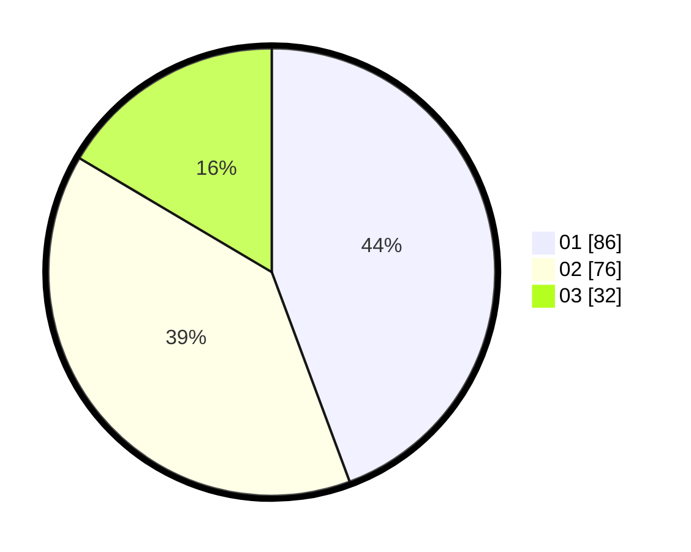

# Hasil

Hasil perolehan suara paslon dapat dilihat pada file paslon-01.txt, paslon-02.txt, dan paslon-03.txt.

Jika tidak ada, artinya data tersebut belum ada pada SIREKAP.

## Perolehan Suara

 * Paslon 01: **86**.
 * Paslon 02: **76**.
 * Paslon 03: **32**.

## Foto C Plano

https://sirekap-obj-formc.kpu.go.id/1990/pemilu/ppwp/31/71/03/10/06/3171031006102-20240217-120123--01de39dd-5552-412e-8353-d2f54ec6c936.jpg

https://sirekap-obj-formc.kpu.go.id/1990/pemilu/ppwp/31/71/03/10/06/3171031006102-20240217-120124--88e72e2d-5c67-4174-a42f-82ca702af642.jpg

https://sirekap-obj-formc.kpu.go.id/1990/pemilu/ppwp/31/71/03/10/06/3171031006102-20240217-120124--c560b280-f38c-4877-851e-55193e38f19f.jpg

## DATA PEMILIH TETAP

Jumlah pemilih dalam DPT: **255**.
 * L: **128**.
 * P: **127**.

## DATA PENGGUNA HAK PILIH

Jumlah pengguna hak pilih dalam DPT: **255**.
 * L: **128**.
 * P: **127**.

Jumlah pengguna hak pilih dalam DPTb: **1**.
 * L: **0**.
 * P: **1**.

Jumlah pengguna hak pilih dalam DPK: **0**.
 * L: **0**.
 * P: **0**.

Jumlah pengguna hak pilih: **256**.
 * L: **128**.
 * P: **128**.

## JUMLAH SUARA SAH DAN TIDAK SAH

JUMLAH SELURUH SUARA SAH: **194**.

JUMLAH SUARA TIDAK SAH: **4**.

JUMLAH SELURUH SUARA SAH DAN SUARA TIDAK SAH: **198**.
