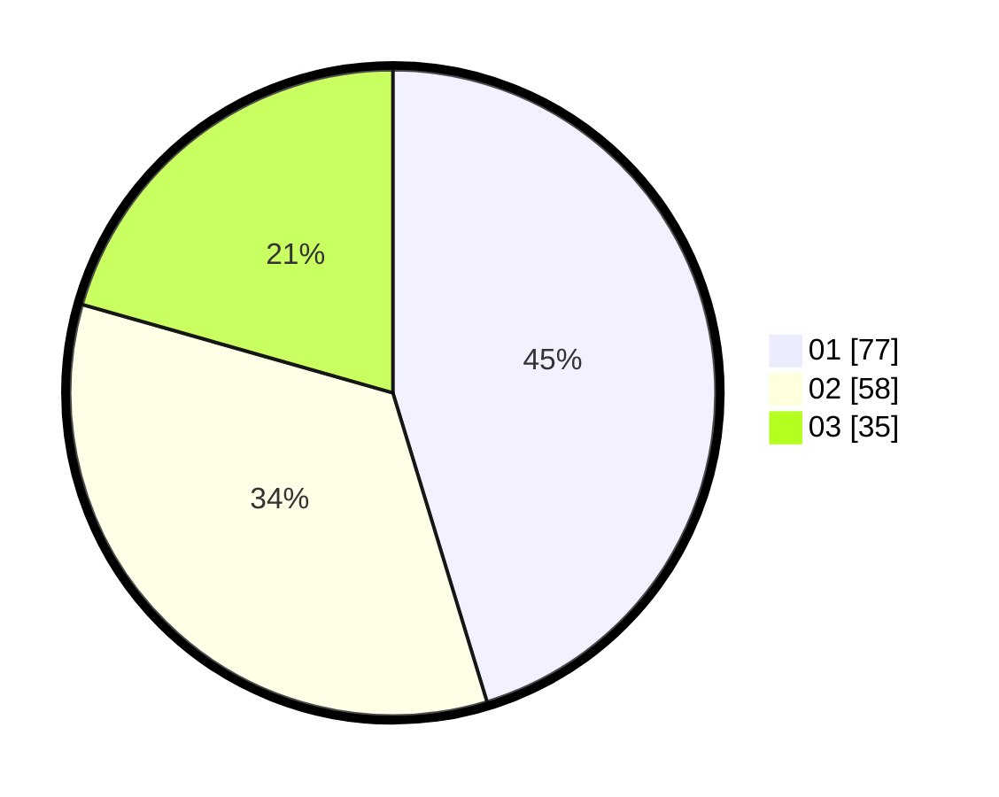

# Hasil

Hasil perolehan suara paslon dapat dilihat pada file paslon-01.txt, paslon-02.txt, dan paslon-03.txt.

Jika tidak ada, artinya data tersebut belum ada pada SIREKAP.

## Perolehan Suara

 * Paslon 01: **77**.
 * Paslon 02: **58**.
 * Paslon 03: **35**.

## Foto C Plano

https://sirekap-obj-formc.kpu.go.id/987e/pemilu/ppwp/31/71/03/10/06/3171031006103-20240215-194602--08d7ec47-f216-4679-af90-65d0509d46ca.jpg

https://sirekap-obj-formc.kpu.go.id/987e/pemilu/ppwp/31/71/03/10/06/3171031006103-20240216-150732--a0783334-778f-49a6-a840-1c9366e1b047.jpg

https://sirekap-obj-formc.kpu.go.id/987e/pemilu/ppwp/31/71/03/10/06/3171031006103-20240215-200257--e9b59696-e564-4345-82d4-63be47974f6e.jpg
