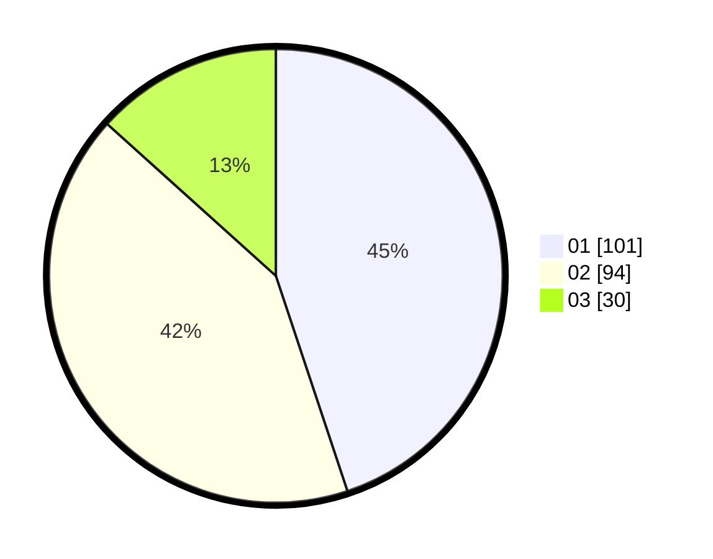

# Hasil

Hasil perolehan suara paslon dapat dilihat pada file paslon-01.txt, paslon-02.txt, dan paslon-03.txt.

Jika tidak ada, artinya data tersebut belum ada pada SIREKAP.

## Perolehan Suara

 * Paslon 01: **101**.
 * Paslon 02: **94**.
 * Paslon 03: **30**.

## Foto C Plano

https://sirekap-obj-formc.kpu.go.id/fcad/pemilu/ppwp/31/71/03/10/06/3171031006106-20240216-133057--fa2285e2-9ab2-47fc-93f8-78b245a38325.jpg

https://sirekap-obj-formc.kpu.go.id/fcad/pemilu/ppwp/31/71/03/10/06/3171031006106-20240216-133058--c9cf2414-1e48-4d0b-9d94-64d6004ca36e.jpg

https://sirekap-obj-formc.kpu.go.id/fcad/pemilu/ppwp/31/71/03/10/06/3171031006106-20240216-133058--8f125151-c2d5-4087-9f2b-45daa185f0fd.jpg

## DATA PEMILIH TETAP

Jumlah pemilih dalam DPT: **265**.
 * L: **124**.
 * P: **141**.

## DATA PENGGUNA HAK PILIH

Jumlah pengguna hak pilih dalam DPT: **224**.
 * L: **98**.
 * P: **126**.

Jumlah pengguna hak pilih dalam DPTb: **0**.
 * L: **0**.
 * P: **0**.

Jumlah pengguna hak pilih dalam DPK: **2**.
 * L: **1**.
 * P: **1**.

Jumlah pengguna hak pilih: **226**.
 * L: **99**.
 * P: **127**.

## JUMLAH SUARA SAH DAN TIDAK SAH

JUMLAH SELURUH SUARA SAH: **225**.

JUMLAH SUARA TIDAK SAH: **1**.

JUMLAH SELURUH SUARA SAH DAN SUARA TIDAK SAH: **226**.
