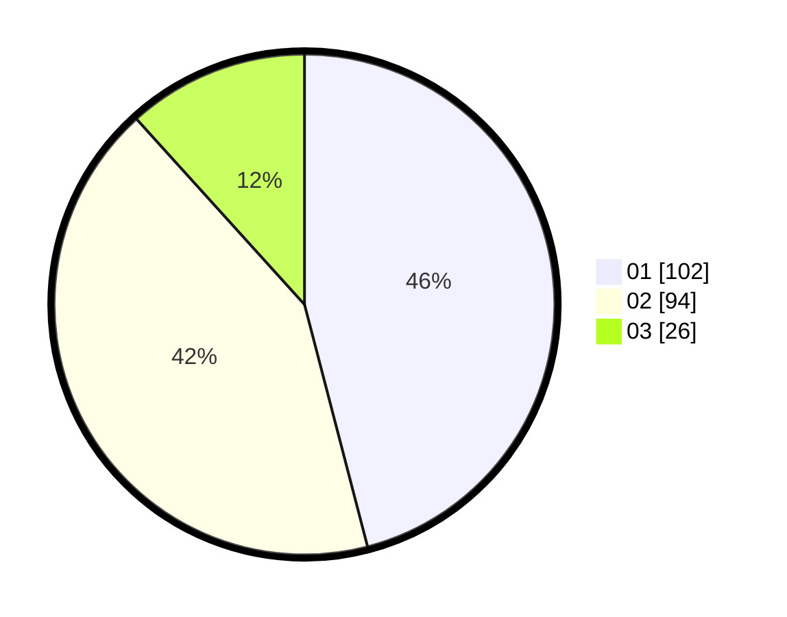

# Hasil

Hasil perolehan suara paslon dapat dilihat pada file paslon-01.txt, paslon-02.txt, dan paslon-03.txt.

Jika tidak ada, artinya data tersebut belum ada pada SIREKAP.

## Perolehan Suara

 * Paslon 01: **102**.
 * Paslon 02: **94**.
 * Paslon 03: **26**.

## Foto C Plano

https://sirekap-obj-formc.kpu.go.id/2c27/pemilu/ppwp/31/71/03/10/06/3171031006107-20240216-054405--5a4703ec-b507-452e-b483-5990086a0366.jpg

https://sirekap-obj-formc.kpu.go.id/2c27/pemilu/ppwp/31/71/03/10/06/3171031006107-20240215-173947--40af738e-6ca7-4576-9349-a383a8fbd092.jpg

https://sirekap-obj-formc.kpu.go.id/2c27/pemilu/ppwp/31/71/03/10/06/3171031006107-20240215-213348--33419c02-a333-4788-936a-c5920c3536a8.jpg

## DATA PEMILIH TETAP

Jumlah pemilih dalam DPT: **284**.
 * L: **127**.
 * P: **157**.

## DATA PENGGUNA HAK PILIH

Jumlah pengguna hak pilih dalam DPT: **217**.
 * L: **96**.
 * P: **121**.

Jumlah pengguna hak pilih dalam DPTb: **6**.
 * L: **1**.
 * P: **5**.

Jumlah pengguna hak pilih dalam DPK: **1**.
 * L: **0**.
 * P: **1**.

Jumlah pengguna hak pilih: **224**.
 * L: **97**.
 * P: **127**.

## JUMLAH SUARA SAH DAN TIDAK SAH

JUMLAH SELURUH SUARA SAH: **222**.

JUMLAH SUARA TIDAK SAH: **2**.

JUMLAH SELURUH SUARA SAH DAN SUARA TIDAK SAH: **224**.
