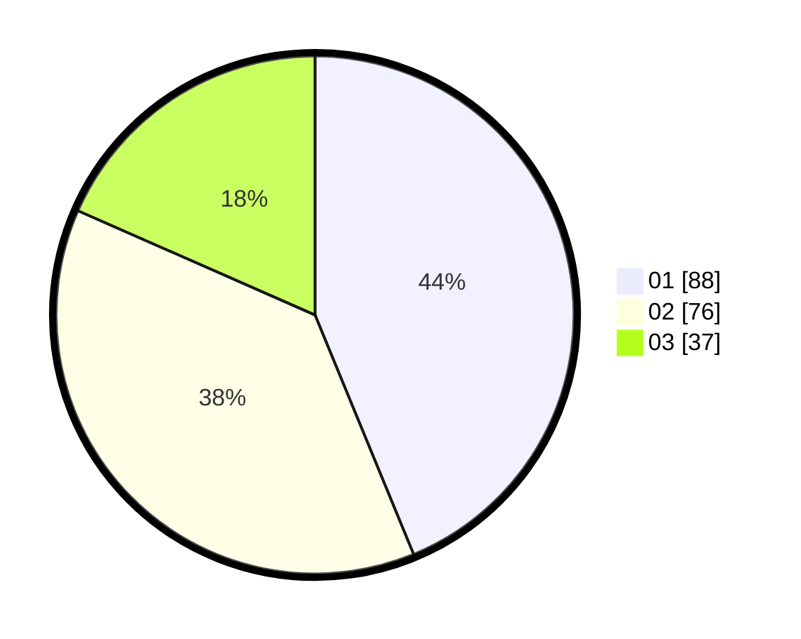

# Hasil

Hasil perolehan suara paslon dapat dilihat pada file paslon-01.txt, paslon-02.txt, dan paslon-03.txt.

Jika tidak ada, artinya data tersebut belum ada pada SIREKAP.

## Perolehan Suara

 * Paslon 01: **88**.
 * Paslon 02: **76**.
 * Paslon 03: **37**.

## Foto C Plano

https://sirekap-obj-formc.kpu.go.id/bb27/pemilu/ppwp/31/71/03/10/07/3171031007004-20240216-135823--f2e509ab-dacd-4423-8378-78d9b3baad43.jpg

https://sirekap-obj-formc.kpu.go.id/bb27/pemilu/ppwp/31/71/03/10/07/3171031007004-20240216-135824--80267d16-755d-403f-bbf1-7a27865fe71e.jpg

https://sirekap-obj-formc.kpu.go.id/bb27/pemilu/ppwp/31/71/03/10/07/3171031007004-20240216-135823--a45cceea-5b2d-4c69-84a6-170e56bfee0a.jpg

## DATA PEMILIH TETAP

Jumlah pemilih dalam DPT: **270**.
 * L: **131**.
 * P: **139**.

## DATA PENGGUNA HAK PILIH

Jumlah pengguna hak pilih dalam DPT: **199**.
 * L: **92**.
 * P: **107**.

Jumlah pengguna hak pilih dalam DPTb: **2**.
 * L: **1**.
 * P: **1**.

Jumlah pengguna hak pilih dalam DPK: **3**.
 * L: **1**.
 * P: **2**.

Jumlah pengguna hak pilih: **204**.
 * L: **94**.
 * P: **110**.

## JUMLAH SUARA SAH DAN TIDAK SAH

JUMLAH SELURUH SUARA SAH: **201**.

JUMLAH SUARA TIDAK SAH: **3**.

JUMLAH SELURUH SUARA SAH DAN SUARA TIDAK SAH: **204**.
