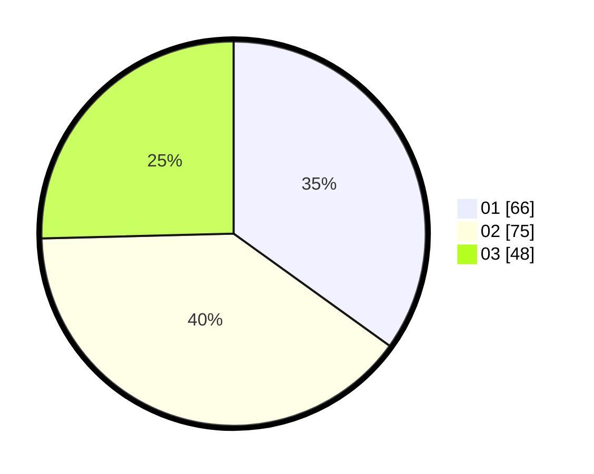

# Hasil

Hasil perolehan suara paslon dapat dilihat pada file paslon-01.txt, paslon-02.txt, dan paslon-03.txt.

Jika tidak ada, artinya data tersebut belum ada pada SIREKAP.

## Perolehan Suara

 * Paslon 01: **66**.
 * Paslon 02: **75**.
 * Paslon 03: **48**.

## Foto C Plano

https://sirekap-obj-formc.kpu.go.id/e32c/pemilu/ppwp/31/71/03/10/07/3171031007005-20240216-020508--aaa89528-7648-443a-9f76-bdf5c8640de8.jpg

https://sirekap-obj-formc.kpu.go.id/e32c/pemilu/ppwp/31/71/03/10/07/3171031007005-20240216-020509--af132253-126d-4763-bec8-5defdafd5566.jpg

https://sirekap-obj-formc.kpu.go.id/e32c/pemilu/ppwp/31/71/03/10/07/3171031007005-20240216-020508--4958dd54-01c9-4365-8a6c-6bca049c9a5b.jpg

## DATA PEMILIH TETAP

Jumlah pemilih dalam DPT: **244**.
 * L: **114**.
 * P: **130**.

## DATA PENGGUNA HAK PILIH

Jumlah pengguna hak pilih dalam DPT: **181**.
 * L: **86**.
 * P: **95**.

Jumlah pengguna hak pilih dalam DPTb: **2**.
 * L: **1**.
 * P: **1**.

Jumlah pengguna hak pilih dalam DPK: **9**.
 * L: **4**.
 * P: **5**.

Jumlah pengguna hak pilih: **192**.
 * L: **91**.
 * P: **101**.

## JUMLAH SUARA SAH DAN TIDAK SAH

JUMLAH SELURUH SUARA SAH: **189**.

JUMLAH SUARA TIDAK SAH: **3**.

JUMLAH SELURUH SUARA SAH DAN SUARA TIDAK SAH: **192**.
