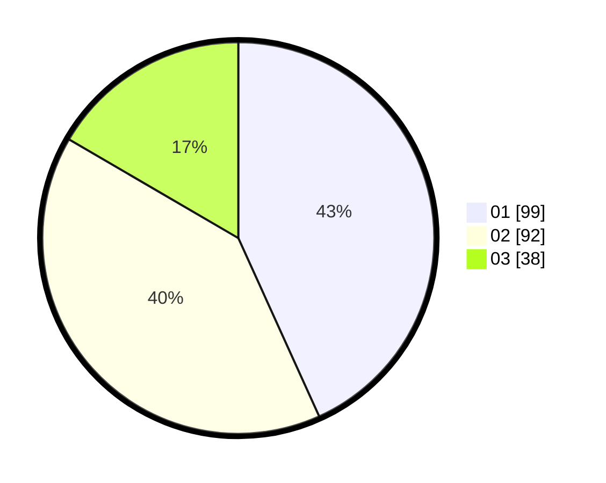

# Hasil

Hasil perolehan suara paslon dapat dilihat pada file paslon-01.txt, paslon-02.txt, dan paslon-03.txt.

Jika tidak ada, artinya data tersebut belum ada pada SIREKAP.

## Perolehan Suara

 * Paslon 01: **99**.
 * Paslon 02: **92**.
 * Paslon 03: **38**.

## Foto C Plano

https://sirekap-obj-formc.kpu.go.id/e6ad/pemilu/ppwp/31/71/03/10/07/3171031007009-20240215-165600--363ed39e-8ea8-462a-b5ac-9a6b914dd7af.jpg

https://sirekap-obj-formc.kpu.go.id/e6ad/pemilu/ppwp/31/71/03/10/07/3171031007009-20240215-165622--0ce73578-49f1-4c87-b949-4c290b29438e.jpg

https://sirekap-obj-formc.kpu.go.id/e6ad/pemilu/ppwp/31/71/03/10/07/3171031007009-20240215-165611--ce411229-d905-44f6-b5ac-08815cb53628.jpg

## DATA PEMILIH TETAP

Jumlah pemilih dalam DPT: **280**.
 * L: **147**.
 * P: **133**.

## DATA PENGGUNA HAK PILIH

Jumlah pengguna hak pilih dalam DPT: **224**.
 * L: **117**.
 * P: **107**.

Jumlah pengguna hak pilih dalam DPTb: **8**.
 * L: **5**.
 * P: **3**.

Jumlah pengguna hak pilih dalam DPK: **3**.
 * L: **1**.
 * P: **2**.

Jumlah pengguna hak pilih: **235**.
 * L: **123**.
 * P: **112**.

## JUMLAH SUARA SAH DAN TIDAK SAH

JUMLAH SELURUH SUARA SAH: **229**.

JUMLAH SUARA TIDAK SAH: **6**.

JUMLAH SELURUH SUARA SAH DAN SUARA TIDAK SAH: **235**.
