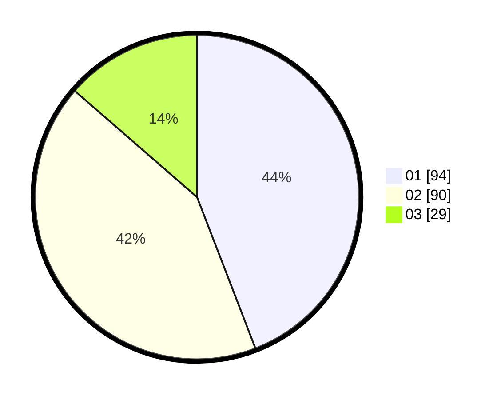

# Hasil

Hasil perolehan suara paslon dapat dilihat pada file paslon-01.txt, paslon-02.txt, dan paslon-03.txt.

Jika tidak ada, artinya data tersebut belum ada pada SIREKAP.

## Perolehan Suara

 * Paslon 01: **94**.
 * Paslon 02: **90**.
 * Paslon 03: **29**.

## Foto C Plano

https://sirekap-obj-formc.kpu.go.id/e48d/pemilu/ppwp/31/71/03/10/07/3171031007010-20240215-090345--3cf8f592-1981-4505-a2a9-9080be4b0ae4.jpg

https://sirekap-obj-formc.kpu.go.id/e48d/pemilu/ppwp/31/71/03/10/07/3171031007010-20240215-090406--7f8f5801-2948-4c9a-81d5-9f20cf12be8d.jpg

https://sirekap-obj-formc.kpu.go.id/e48d/pemilu/ppwp/31/71/03/10/07/3171031007010-20240215-090355--a210d033-c0c0-4f1e-97cf-08038b43df15.jpg

## DATA PEMILIH TETAP

Jumlah pemilih dalam DPT: **264**.
 * L: **128**.
 * P: **136**.

## DATA PENGGUNA HAK PILIH

Jumlah pengguna hak pilih dalam DPT: **215**.
 * L: **98**.
 * P: **117**.

Jumlah pengguna hak pilih dalam DPTb: **2**.
 * L: **1**.
 * P: **1**.

Jumlah pengguna hak pilih dalam DPK: **1**.
 * L: **1**.
 * P: **0**.

Jumlah pengguna hak pilih: **218**.
 * L: **100**.
 * P: **118**.

## JUMLAH SUARA SAH DAN TIDAK SAH

JUMLAH SELURUH SUARA SAH: **213**.

JUMLAH SUARA TIDAK SAH: **5**.

JUMLAH SELURUH SUARA SAH DAN SUARA TIDAK SAH: **218**.
