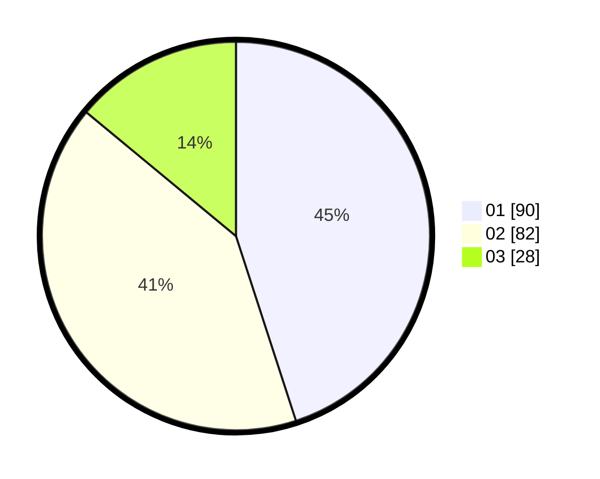

# Hasil

Hasil perolehan suara paslon dapat dilihat pada file paslon-01.txt, paslon-02.txt, dan paslon-03.txt.

Jika tidak ada, artinya data tersebut belum ada pada SIREKAP.

## Perolehan Suara

 * Paslon 01: **90**.
 * Paslon 02: **82**.
 * Paslon 03: **28**.

## Foto C Plano

https://sirekap-obj-formc.kpu.go.id/8729/pemilu/ppwp/31/71/03/10/07/3171031007011-20240215-215312--9fd8b5a9-83f1-49ec-9697-557a2ab89fe0.jpg

https://sirekap-obj-formc.kpu.go.id/8729/pemilu/ppwp/31/71/03/10/07/3171031007011-20240214-155738--085e5511-d875-4dbb-940f-51c339be0934.jpg

https://sirekap-obj-formc.kpu.go.id/8729/pemilu/ppwp/31/71/03/10/07/3171031007011-20240215-215313--c3e7ad71-c411-4ac0-9ffa-a386d636c308.jpg

## DATA PEMILIH TETAP

Jumlah pemilih dalam DPT: **262**.
 * L: **126**.
 * P: **136**.

## DATA PENGGUNA HAK PILIH

Jumlah pengguna hak pilih dalam DPT: **195**.
 * L: **86**.
 * P: **109**.

Jumlah pengguna hak pilih dalam DPTb: **2**.
 * L: **1**.
 * P: **1**.

Jumlah pengguna hak pilih dalam DPK: **4**.
 * L: **1**.
 * P: **3**.

Jumlah pengguna hak pilih: **201**.
 * L: **88**.
 * P: **113**.

## JUMLAH SUARA SAH DAN TIDAK SAH

JUMLAH SELURUH SUARA SAH: **200**.

JUMLAH SUARA TIDAK SAH: **1**.

JUMLAH SELURUH SUARA SAH DAN SUARA TIDAK SAH: **201**.
