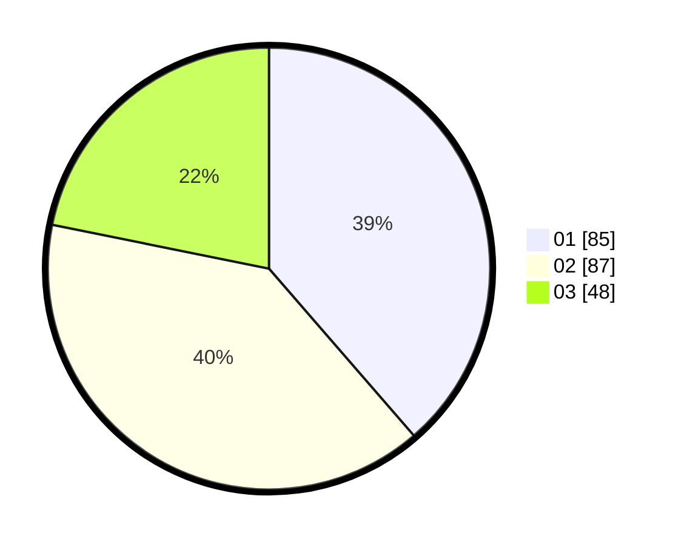

# Hasil

Hasil perolehan suara paslon dapat dilihat pada file paslon-01.txt, paslon-02.txt, dan paslon-03.txt.

Jika tidak ada, artinya data tersebut belum ada pada SIREKAP.

## Perolehan Suara

 * Paslon 01: **85**.
 * Paslon 02: **87**.
 * Paslon 03: **48**.

## Foto C Plano

https://sirekap-obj-formc.kpu.go.id/a934/pemilu/ppwp/31/71/03/10/07/3171031007017-20240214-193141--08b1b5a4-a052-4d23-a6a3-0f1ea7e521be.jpg

https://sirekap-obj-formc.kpu.go.id/a934/pemilu/ppwp/31/71/03/10/07/3171031007017-20240215-035709--c647118f-aae6-425d-a754-4639c6c1acba.jpg

https://sirekap-obj-formc.kpu.go.id/a934/pemilu/ppwp/31/71/03/10/07/3171031007017-20240214-194208--f77db739-35ad-4be4-a498-ad3a2c447a6b.jpg

## DATA PEMILIH TETAP

Jumlah pemilih dalam DPT: **273**.
 * L: **133**.
 * P: **140**.

## DATA PENGGUNA HAK PILIH

Jumlah pengguna hak pilih dalam DPT: **222**.
 * L: **102**.
 * P: **120**.

Jumlah pengguna hak pilih dalam DPTb: **0**.
 * L: **0**.
 * P: **0**.

Jumlah pengguna hak pilih dalam DPK: **2**.
 * L: **1**.
 * P: **1**.

Jumlah pengguna hak pilih: **224**.
 * L: **103**.
 * P: **121**.

## JUMLAH SUARA SAH DAN TIDAK SAH

JUMLAH SELURUH SUARA SAH: **220**.

JUMLAH SUARA TIDAK SAH: **4**.

JUMLAH SELURUH SUARA SAH DAN SUARA TIDAK SAH: **224**.
