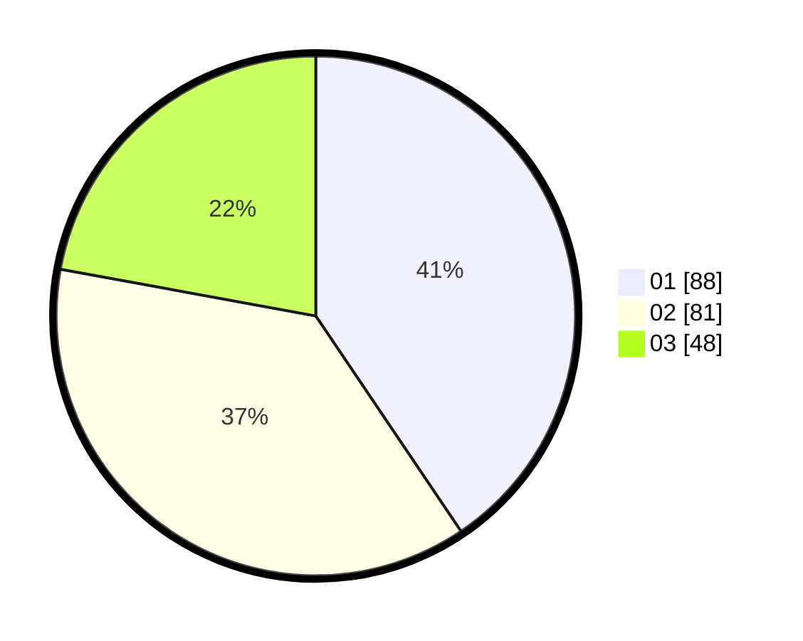

# Hasil

Hasil perolehan suara paslon dapat dilihat pada file paslon-01.txt, paslon-02.txt, dan paslon-03.txt.

Jika tidak ada, artinya data tersebut belum ada pada SIREKAP.

## Perolehan Suara

 * Paslon 01: **88**.
 * Paslon 02: **81**.
 * Paslon 03: **48**.

## Foto C Plano

https://sirekap-obj-formc.kpu.go.id/0707/pemilu/ppwp/31/71/03/10/07/3171031007021-20240214-224609--c35b1534-f3ee-4300-9806-8f1f0eb1cf1b.jpg

https://sirekap-obj-formc.kpu.go.id/0707/pemilu/ppwp/31/71/03/10/07/3171031007021-20240214-224644--1c79881d-4ea6-4c34-8884-c03479d33537.jpg

https://sirekap-obj-formc.kpu.go.id/0707/pemilu/ppwp/31/71/03/10/07/3171031007021-20240214-224742--176e0703-0b7f-4555-b2e6-dff5455c6eea.jpg

## DATA PEMILIH TETAP

Jumlah pemilih dalam DPT: **286**.
 * L: **129**.
 * P: **157**.

## DATA PENGGUNA HAK PILIH

Jumlah pengguna hak pilih dalam DPT: **212**.
 * L: **99**.
 * P: **113**.

Jumlah pengguna hak pilih dalam DPTb: **10**.
 * L: **3**.
 * P: **7**.

Jumlah pengguna hak pilih dalam DPK: **0**.
 * L: **0**.
 * P: **0**.

Jumlah pengguna hak pilih: **222**.
 * L: **102**.
 * P: **120**.

## JUMLAH SUARA SAH DAN TIDAK SAH

JUMLAH SELURUH SUARA SAH: **217**.

JUMLAH SUARA TIDAK SAH: **5**.

JUMLAH SELURUH SUARA SAH DAN SUARA TIDAK SAH: **222**.
