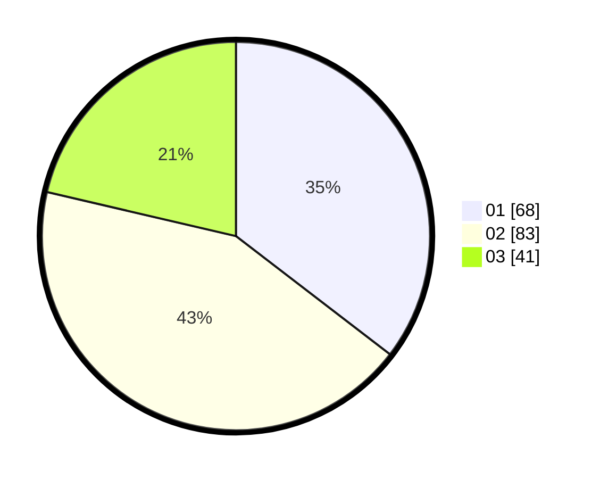

# Hasil

Hasil perolehan suara paslon dapat dilihat pada file paslon-01.txt, paslon-02.txt, dan paslon-03.txt.

Jika tidak ada, artinya data tersebut belum ada pada SIREKAP.

## Perolehan Suara

 * Paslon 01: **68**.
 * Paslon 02: **83**.
 * Paslon 03: **41**.

## Foto C Plano

https://sirekap-obj-formc.kpu.go.id/98c1/pemilu/ppwp/31/71/03/10/07/3171031007022-20240215-220129--d28e7a18-b386-4bcd-8323-2c07f058b9f9.jpg

https://sirekap-obj-formc.kpu.go.id/98c1/pemilu/ppwp/31/71/03/10/07/3171031007022-20240215-220131--654868ea-4f59-472f-9ad1-b8468fdab8e6.jpg

https://sirekap-obj-formc.kpu.go.id/98c1/pemilu/ppwp/31/71/03/10/07/3171031007022-20240215-220131--500c11a5-ece9-4c30-b8c1-f224ad81afa1.jpg

## DATA PEMILIH TETAP

Jumlah pemilih dalam DPT: **259**.
 * L: **129**.
 * P: **130**.

## DATA PENGGUNA HAK PILIH

Jumlah pengguna hak pilih dalam DPT: **189**.
 * L: **88**.
 * P: **101**.

Jumlah pengguna hak pilih dalam DPTb: **4**.
 * L: **1**.
 * P: **3**.

Jumlah pengguna hak pilih dalam DPK: **1**.
 * L: **0**.
 * P: **1**.

Jumlah pengguna hak pilih: **194**.
 * L: **89**.
 * P: **105**.

## JUMLAH SUARA SAH DAN TIDAK SAH

JUMLAH SELURUH SUARA SAH: **192**.

JUMLAH SUARA TIDAK SAH: **2**.

JUMLAH SELURUH SUARA SAH DAN SUARA TIDAK SAH: **194**.
