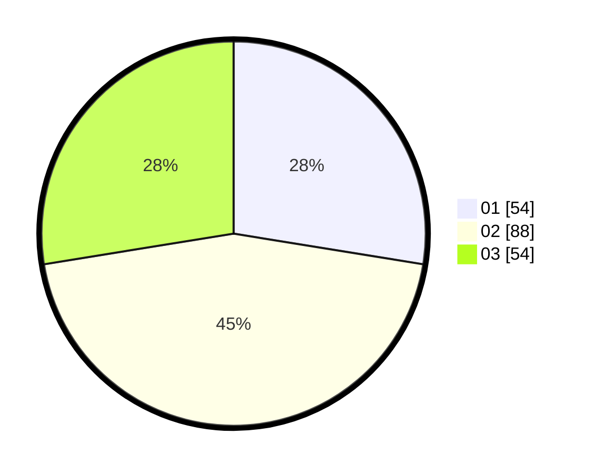

# Hasil

Hasil perolehan suara paslon dapat dilihat pada file paslon-01.txt, paslon-02.txt, dan paslon-03.txt.

Jika tidak ada, artinya data tersebut belum ada pada SIREKAP.

## Perolehan Suara

 * Paslon 01: **54**.
 * Paslon 02: **88**.
 * Paslon 03: **54**.

## Foto C Plano

https://sirekap-obj-formc.kpu.go.id/97f2/pemilu/ppwp/31/71/03/10/07/3171031007023-20240215-213128--3bcc63e9-259c-47f1-abec-61225dc42991.jpg

https://sirekap-obj-formc.kpu.go.id/97f2/pemilu/ppwp/31/71/03/10/07/3171031007023-20240215-213131--340e996c-e9b0-4409-b87b-744925c50707.jpg

https://sirekap-obj-formc.kpu.go.id/97f2/pemilu/ppwp/31/71/03/10/07/3171031007023-20240215-213130--b25cfd8f-50d5-490d-9672-03ad0693be29.jpg

## DATA PEMILIH TETAP

Jumlah pemilih dalam DPT: **280**.
 * L: **135**.
 * P: **145**.

## DATA PENGGUNA HAK PILIH

Jumlah pengguna hak pilih dalam DPT: **196**.
 * L: **94**.
 * P: **102**.

Jumlah pengguna hak pilih dalam DPTb: **2**.
 * L: **1**.
 * P: **1**.

Jumlah pengguna hak pilih dalam DPK: **0**.
 * L: **0**.
 * P: **0**.

Jumlah pengguna hak pilih: **198**.
 * L: **95**.
 * P: **103**.

## JUMLAH SUARA SAH DAN TIDAK SAH

JUMLAH SELURUH SUARA SAH: **196**.

JUMLAH SUARA TIDAK SAH: **2**.

JUMLAH SELURUH SUARA SAH DAN SUARA TIDAK SAH: **198**.
