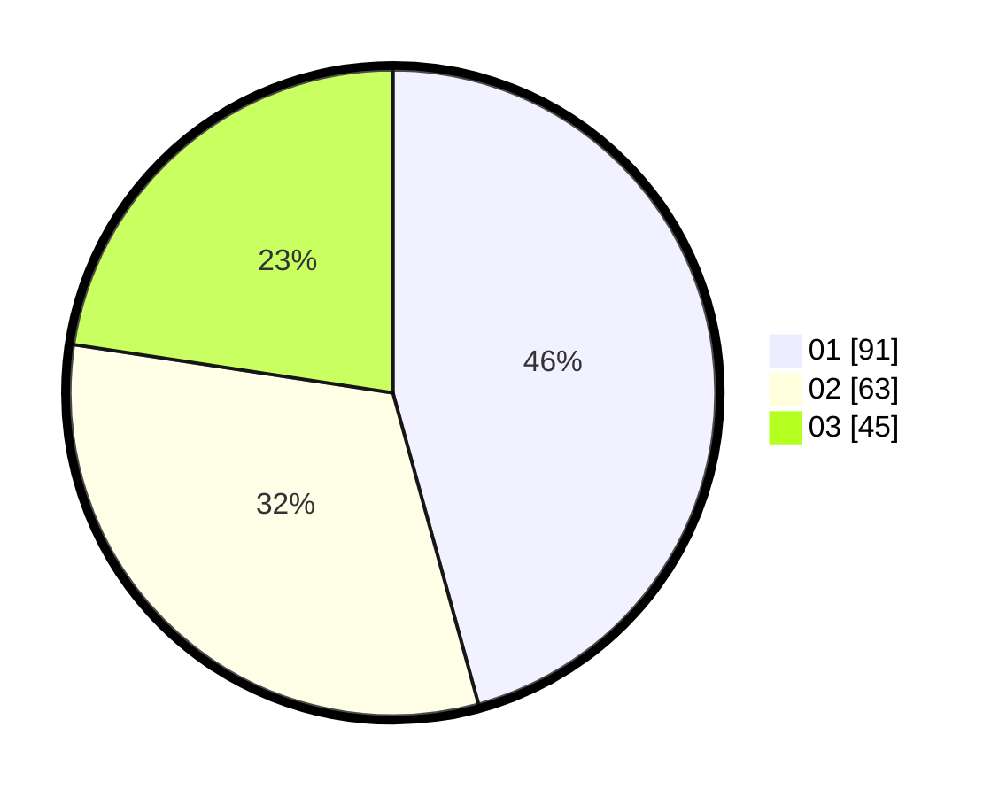

# Hasil

Hasil perolehan suara paslon dapat dilihat pada file paslon-01.txt, paslon-02.txt, dan paslon-03.txt.

Jika tidak ada, artinya data tersebut belum ada pada SIREKAP.

## Perolehan Suara

 * Paslon 01: **91**.
 * Paslon 02: **63**.
 * Paslon 03: **45**.

## Foto C Plano

https://sirekap-obj-formc.kpu.go.id/ab25/pemilu/ppwp/31/71/03/10/07/3171031007025-20240216-124229--82b344f6-24db-4ff7-95b9-96908eec59f8.jpg

https://sirekap-obj-formc.kpu.go.id/ab25/pemilu/ppwp/31/71/03/10/07/3171031007025-20240216-124248--f644ce30-8da1-424f-8f35-7da7aa4dcd29.jpg

https://sirekap-obj-formc.kpu.go.id/ab25/pemilu/ppwp/31/71/03/10/07/3171031007025-20240216-124243--de04f799-304c-4569-b85b-d5cf5ee944bc.jpg

## DATA PEMILIH TETAP

Jumlah pemilih dalam DPT: **271**.
 * L: **140**.
 * P: **131**.

## DATA PENGGUNA HAK PILIH

Jumlah pengguna hak pilih dalam DPT: **202**.
 * L: **101**.
 * P: **101**.

Jumlah pengguna hak pilih dalam DPTb: **1**.
 * L: **0**.
 * P: **1**.

Jumlah pengguna hak pilih dalam DPK: **3**.
 * L: **2**.
 * P: **1**.

Jumlah pengguna hak pilih: **206**.
 * L: **103**.
 * P: **103**.

## JUMLAH SUARA SAH DAN TIDAK SAH

JUMLAH SELURUH SUARA SAH: **199**.

JUMLAH SUARA TIDAK SAH: **3**.

JUMLAH SELURUH SUARA SAH DAN SUARA TIDAK SAH: **202**.
