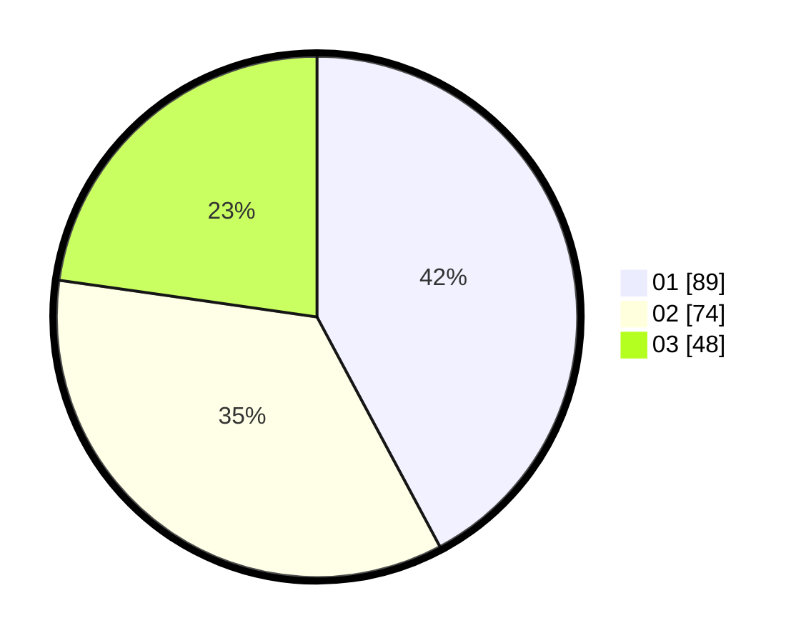

# Hasil

Hasil perolehan suara paslon dapat dilihat pada file paslon-01.txt, paslon-02.txt, dan paslon-03.txt.

Jika tidak ada, artinya data tersebut belum ada pada SIREKAP.

## Perolehan Suara

 * Paslon 01: **89**.
 * Paslon 02: **74**.
 * Paslon 03: **48**.

## Foto C Plano

https://sirekap-obj-formc.kpu.go.id/93d6/pemilu/ppwp/31/71/03/10/07/3171031007026-20240216-052140--90eadee3-d4b6-4791-8e36-776b86cd0d3d.jpg

https://sirekap-obj-formc.kpu.go.id/93d6/pemilu/ppwp/31/71/03/10/07/3171031007026-20240216-052142--9fdcf98a-949b-45e8-a67c-b11ff9bedddb.jpg

https://sirekap-obj-formc.kpu.go.id/93d6/pemilu/ppwp/31/71/03/10/07/3171031007026-20240216-052141--bea777e6-0fa0-4201-a23c-02eab668f62e.jpg

## DATA PEMILIH TETAP

Jumlah pemilih dalam DPT: **272**.
 * L: **138**.
 * P: **134**.

## DATA PENGGUNA HAK PILIH

Jumlah pengguna hak pilih dalam DPT: **206**.
 * L: **100**.
 * P: **106**.

Jumlah pengguna hak pilih dalam DPTb: **11**.
 * L: **5**.
 * P: **6**.

Jumlah pengguna hak pilih dalam DPK: **0**.
 * L: **0**.
 * P: **0**.

Jumlah pengguna hak pilih: **217**.
 * L: **105**.
 * P: **112**.

## JUMLAH SUARA SAH DAN TIDAK SAH

JUMLAH SELURUH SUARA SAH: **211**.

JUMLAH SUARA TIDAK SAH: **6**.

JUMLAH SELURUH SUARA SAH DAN SUARA TIDAK SAH: **217**.
