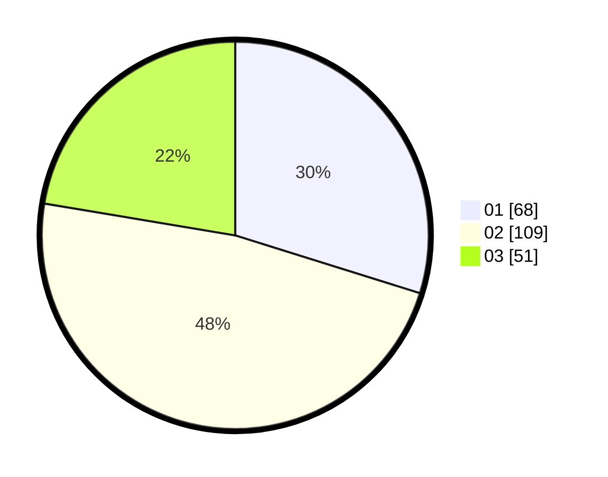

# Hasil

Hasil perolehan suara paslon dapat dilihat pada file paslon-01.txt, paslon-02.txt, dan paslon-03.txt.

Jika tidak ada, artinya data tersebut belum ada pada SIREKAP.

## Perolehan Suara

 * Paslon 01: **68**.
 * Paslon 02: **109**.
 * Paslon 03: **51**.

## Foto C Plano

https://sirekap-obj-formc.kpu.go.id/08a0/pemilu/ppwp/31/71/03/10/07/3171031007029-20240214-185723--c4645152-b090-4da1-af43-d2b1a7c64048.jpg

https://sirekap-obj-formc.kpu.go.id/08a0/pemilu/ppwp/31/71/03/10/07/3171031007029-20240216-133305--02d5568e-2464-4b41-be6d-d28b607f2ef4.jpg

https://sirekap-obj-formc.kpu.go.id/08a0/pemilu/ppwp/31/71/03/10/07/3171031007029-20240214-190522--9397ddb7-9677-4404-bb4a-97a8adf16ed7.jpg

## DATA PEMILIH TETAP

Jumlah pemilih dalam DPT: **288**.
 * L: **134**.
 * P: **154**.

## DATA PENGGUNA HAK PILIH

Jumlah pengguna hak pilih dalam DPT: **223**.
 * L: **103**.
 * P: **120**.

Jumlah pengguna hak pilih dalam DPTb: **3**.
 * L: **1**.
 * P: **2**.

Jumlah pengguna hak pilih dalam DPK: **5**.
 * L: **3**.
 * P: **2**.

Jumlah pengguna hak pilih: **231**.
 * L: **107**.
 * P: **124**.

## JUMLAH SUARA SAH DAN TIDAK SAH

JUMLAH SELURUH SUARA SAH: **228**.

JUMLAH SUARA TIDAK SAH: **3**.

JUMLAH SELURUH SUARA SAH DAN SUARA TIDAK SAH: **231**.
