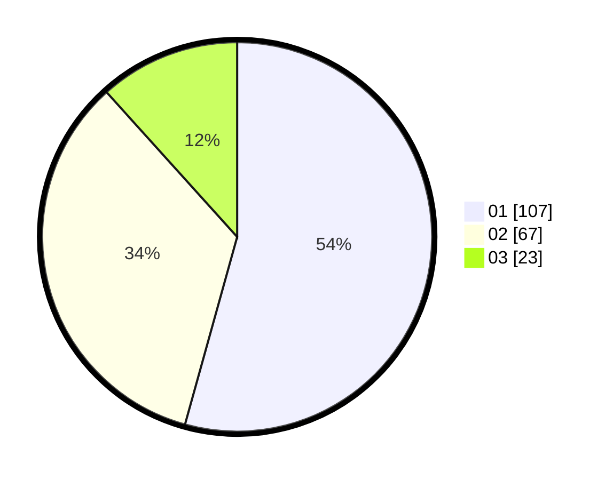

# Hasil

Hasil perolehan suara paslon dapat dilihat pada file paslon-01.txt, paslon-02.txt, dan paslon-03.txt.

Jika tidak ada, artinya data tersebut belum ada pada SIREKAP.

## Perolehan Suara

 * Paslon 01: **107**.
 * Paslon 02: **67**.
 * Paslon 03: **23**.

## Foto C Plano

https://sirekap-obj-formc.kpu.go.id/e7cd/pemilu/ppwp/31/71/03/10/07/3171031007033-20240216-052220--45f7213f-24fe-4268-9178-c1b1779edab5.jpg

https://sirekap-obj-formc.kpu.go.id/e7cd/pemilu/ppwp/31/71/03/10/07/3171031007033-20240216-052706--d6dddcf9-ec4a-4d0c-b91d-1da3666fa5a3.jpg

https://sirekap-obj-formc.kpu.go.id/e7cd/pemilu/ppwp/31/71/03/10/07/3171031007033-20240216-052223--7bc31c9b-6fc9-4f3b-ae23-b058c45794a1.jpg

## DATA PEMILIH TETAP

Jumlah pemilih dalam DPT: **201**.
 * L: **91**.
 * P: **110**.

## DATA PENGGUNA HAK PILIH

Jumlah pengguna hak pilih dalam DPT: **197**.
 * L: **90**.
 * P: **107**.

Jumlah pengguna hak pilih dalam DPTb: **4**.
 * L: **1**.
 * P: **3**.

Jumlah pengguna hak pilih dalam DPK: **0**.
 * L: **0**.
 * P: **0**.

Jumlah pengguna hak pilih: **201**.
 * L: **91**.
 * P: **110**.

## JUMLAH SUARA SAH DAN TIDAK SAH

JUMLAH SELURUH SUARA SAH: **197**.

JUMLAH SUARA TIDAK SAH: **4**.

JUMLAH SELURUH SUARA SAH DAN SUARA TIDAK SAH: **201**.
