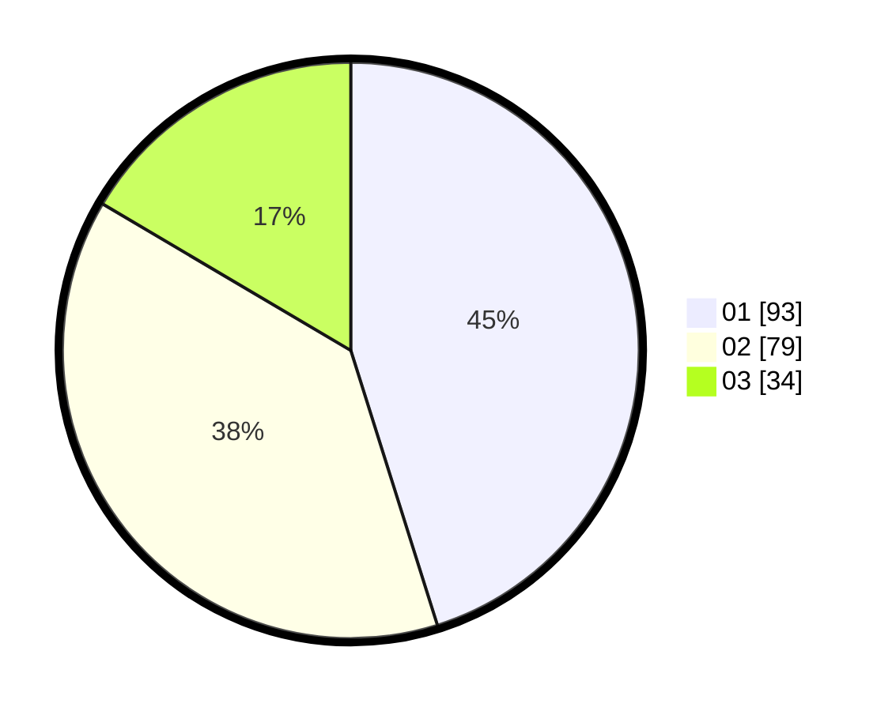

# Hasil

Hasil perolehan suara paslon dapat dilihat pada file paslon-01.txt, paslon-02.txt, dan paslon-03.txt.

Jika tidak ada, artinya data tersebut belum ada pada SIREKAP.

## Perolehan Suara

 * Paslon 01: **93**.
 * Paslon 02: **79**.
 * Paslon 03: **34**.

## Foto C Plano

https://sirekap-obj-formc.kpu.go.id/8c98/pemilu/ppwp/31/71/03/10/07/3171031007034-20240217-103711--9a430b52-e5bf-41fa-9367-699ba27b0513.jpg

https://sirekap-obj-formc.kpu.go.id/8c98/pemilu/ppwp/31/71/03/10/07/3171031007034-20240217-103713--c66f5cc2-22d6-4912-bfc2-a1e5326816b3.jpg

https://sirekap-obj-formc.kpu.go.id/8c98/pemilu/ppwp/31/71/03/10/07/3171031007034-20240217-103712--ab529676-0454-4a72-bf21-2cd49a088188.jpg

## DATA PEMILIH TETAP

Jumlah pemilih dalam DPT: **263**.
 * L: **130**.
 * P: **133**.

## DATA PENGGUNA HAK PILIH

Jumlah pengguna hak pilih dalam DPT: **202**.
 * L: **97**.
 * P: **105**.

Jumlah pengguna hak pilih dalam DPTb: **3**.
 * L: **1**.
 * P: **2**.

Jumlah pengguna hak pilih dalam DPK: **3**.
 * L: **0**.
 * P: **3**.

Jumlah pengguna hak pilih: **208**.
 * L: **98**.
 * P: **110**.

## JUMLAH SUARA SAH DAN TIDAK SAH

JUMLAH SELURUH SUARA SAH: **206**.

JUMLAH SUARA TIDAK SAH: **2**.

JUMLAH SELURUH SUARA SAH DAN SUARA TIDAK SAH: **208**.
