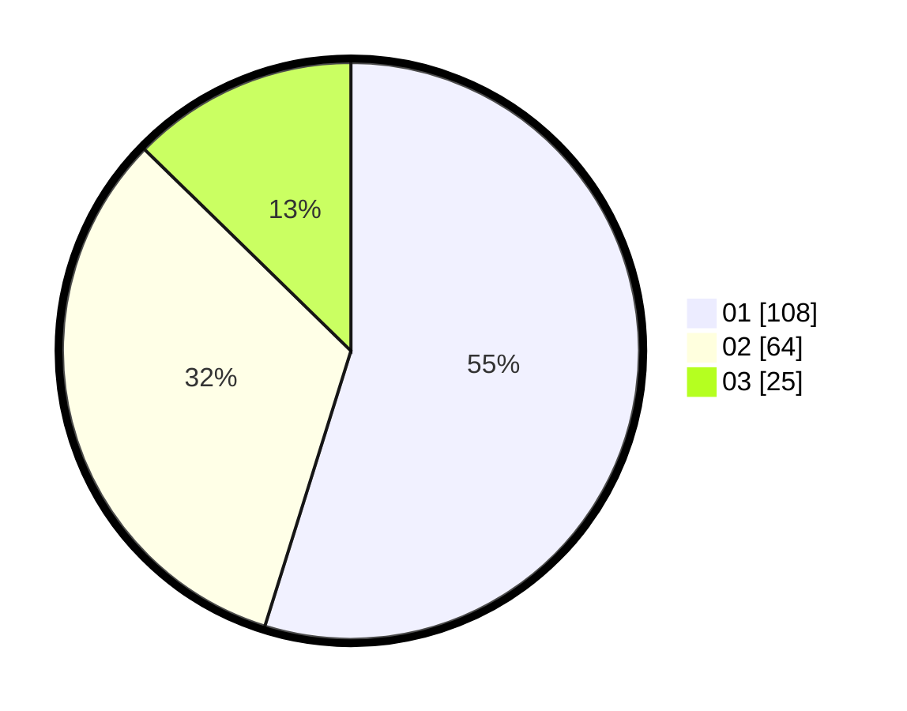

# Hasil

Hasil perolehan suara paslon dapat dilihat pada file paslon-01.txt, paslon-02.txt, dan paslon-03.txt.

Jika tidak ada, artinya data tersebut belum ada pada SIREKAP.

## Perolehan Suara

 * Paslon 01: **108**.
 * Paslon 02: **64**.
 * Paslon 03: **25**.

## Foto C Plano

https://sirekap-obj-formc.kpu.go.id/7f9d/pemilu/ppwp/31/71/03/10/07/3171031007036-20240216-023928--ad58b103-9e54-4fc5-99b7-d533616ef9a9.jpg

https://sirekap-obj-formc.kpu.go.id/7f9d/pemilu/ppwp/31/71/03/10/07/3171031007036-20240216-023936--f8ac39c2-e8ea-48c3-b456-9e5a1ed06fd8.jpg

https://sirekap-obj-formc.kpu.go.id/7f9d/pemilu/ppwp/31/71/03/10/07/3171031007036-20240216-023932--552e6771-4bcb-49d0-945a-c1427791808f.jpg

## DATA PEMILIH TETAP

Jumlah pemilih dalam DPT: **195**.
 * L: **92**.
 * P: **103**.

## DATA PENGGUNA HAK PILIH

Jumlah pengguna hak pilih dalam DPT: **195**.
 * L: **92**.
 * P: **103**.

Jumlah pengguna hak pilih dalam DPTb: **4**.
 * L: **1**.
 * P: **3**.

Jumlah pengguna hak pilih dalam DPK: **0**.
 * L: **0**.
 * P: **0**.

Jumlah pengguna hak pilih: **199**.
 * L: **93**.
 * P: **106**.

## JUMLAH SUARA SAH DAN TIDAK SAH

JUMLAH SELURUH SUARA SAH: **197**.

JUMLAH SUARA TIDAK SAH: **2**.

JUMLAH SELURUH SUARA SAH DAN SUARA TIDAK SAH: **199**.
