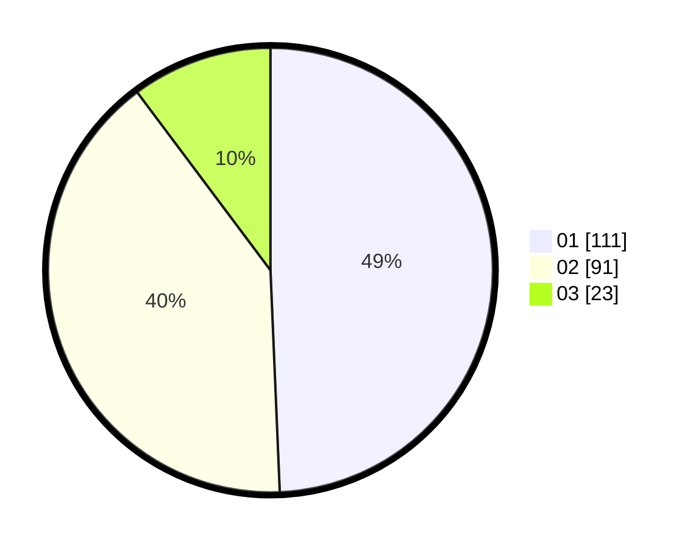

# Hasil

Hasil perolehan suara paslon dapat dilihat pada file paslon-01.txt, paslon-02.txt, dan paslon-03.txt.

Jika tidak ada, artinya data tersebut belum ada pada SIREKAP.

## Perolehan Suara

 * Paslon 01: **111**.
 * Paslon 02: **91**.
 * Paslon 03: **23**.

## Foto C Plano

https://sirekap-obj-formc.kpu.go.id/ac3a/pemilu/ppwp/31/71/03/10/07/3171031007040-20240216-220820--e588e329-77b8-47b5-bb90-c0464c952187.jpg

https://sirekap-obj-formc.kpu.go.id/ac3a/pemilu/ppwp/31/71/03/10/07/3171031007040-20240216-220821--163e2f63-fed4-48ed-a2b9-28dc79990960.jpg

https://sirekap-obj-formc.kpu.go.id/ac3a/pemilu/ppwp/31/71/03/10/07/3171031007040-20240216-220821--7a354ccb-b3b0-458a-a8fe-fa08895aba9d.jpg

## DATA PEMILIH TETAP

Jumlah pemilih dalam DPT: **275**.
 * L: **139**.
 * P: **136**.

## DATA PENGGUNA HAK PILIH

Jumlah pengguna hak pilih dalam DPT: **222**.
 * L: **108**.
 * P: **114**.

Jumlah pengguna hak pilih dalam DPTb: **6**.
 * L: **2**.
 * P: **4**.

Jumlah pengguna hak pilih dalam DPK: **0**.
 * L: **0**.
 * P: **0**.

Jumlah pengguna hak pilih: **228**.
 * L: **110**.
 * P: **118**.

## JUMLAH SUARA SAH DAN TIDAK SAH

JUMLAH SELURUH SUARA SAH: **225**.

JUMLAH SUARA TIDAK SAH: **3**.

JUMLAH SELURUH SUARA SAH DAN SUARA TIDAK SAH: **228**.
