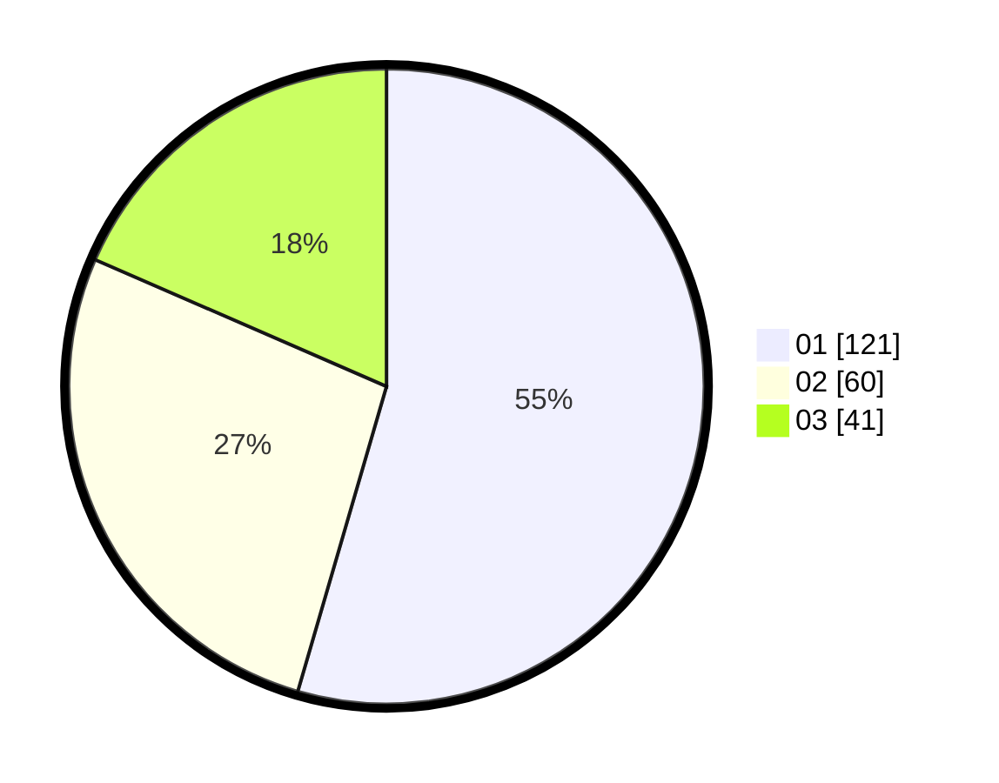

# Hasil

Hasil perolehan suara paslon dapat dilihat pada file paslon-01.txt, paslon-02.txt, dan paslon-03.txt.

Jika tidak ada, artinya data tersebut belum ada pada SIREKAP.

## Perolehan Suara

 * Paslon 01: **121**.
 * Paslon 02: **60**.
 * Paslon 03: **41**.

## Foto C Plano

https://sirekap-obj-formc.kpu.go.id/accd/pemilu/ppwp/31/71/03/10/07/3171031007041-20240216-132157--d70ffd27-e8c7-4c6c-ba71-236b37d1405f.jpg

https://sirekap-obj-formc.kpu.go.id/accd/pemilu/ppwp/31/71/03/10/07/3171031007041-20240216-132158--8ef54f5f-998d-428b-bd07-1c7debb8ce6b.jpg

https://sirekap-obj-formc.kpu.go.id/accd/pemilu/ppwp/31/71/03/10/07/3171031007041-20240216-132158--0c446a8d-16d4-45f4-ac5d-ce7c7cd34de1.jpg

## DATA PEMILIH TETAP

Jumlah pemilih dalam DPT: **223**.
 * L: **100**.
 * P: **123**.

## DATA PENGGUNA HAK PILIH

Jumlah pengguna hak pilih dalam DPT: **223**.
 * L: **100**.
 * P: **123**.

Jumlah pengguna hak pilih dalam DPTb: **0**.
 * L: **0**.
 * P: **0**.

Jumlah pengguna hak pilih dalam DPK: **1**.
 * L: **0**.
 * P: **1**.

Jumlah pengguna hak pilih: **224**.
 * L: **100**.
 * P: **124**.

## JUMLAH SUARA SAH DAN TIDAK SAH

JUMLAH SELURUH SUARA SAH: **222**.

JUMLAH SUARA TIDAK SAH: **2**.

JUMLAH SELURUH SUARA SAH DAN SUARA TIDAK SAH: **224**.
