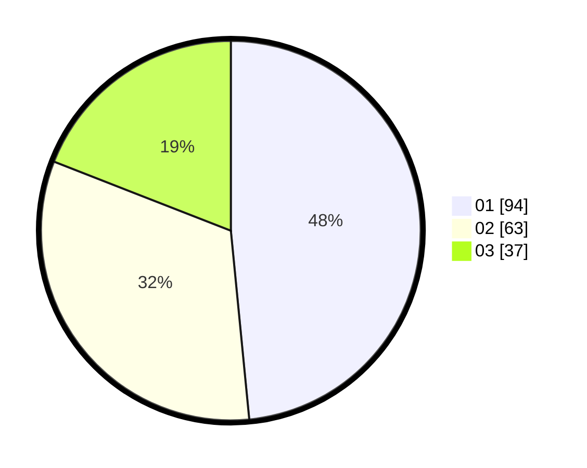

# Hasil

Hasil perolehan suara paslon dapat dilihat pada file paslon-01.txt, paslon-02.txt, dan paslon-03.txt.

Jika tidak ada, artinya data tersebut belum ada pada SIREKAP.

## Perolehan Suara

 * Paslon 01: **94**.
 * Paslon 02: **63**.
 * Paslon 03: **37**.

## Foto C Plano

https://sirekap-obj-formc.kpu.go.id/e25b/pemilu/ppwp/31/71/03/10/07/3171031007042-20240216-133947--b048dafb-c513-4f2b-ab60-c91851d51489.jpg

https://sirekap-obj-formc.kpu.go.id/e25b/pemilu/ppwp/31/71/03/10/07/3171031007042-20240216-133948--dc5c9578-55f2-4684-9e2d-54e355fe639d.jpg

https://sirekap-obj-formc.kpu.go.id/e25b/pemilu/ppwp/31/71/03/10/07/3171031007042-20240216-133948--e3b33eed-6723-4851-b6bb-f07d6302abbd.jpg

## DATA PEMILIH TETAP

Jumlah pemilih dalam DPT: **256**.
 * L: **115**.
 * P: **141**.

## DATA PENGGUNA HAK PILIH

Jumlah pengguna hak pilih dalam DPT: **187**.
 * L: **86**.
 * P: **101**.

Jumlah pengguna hak pilih dalam DPTb: **4**.
 * L: **2**.
 * P: **2**.

Jumlah pengguna hak pilih dalam DPK: **3**.
 * L: **1**.
 * P: **2**.

Jumlah pengguna hak pilih: **194**.
 * L: **89**.
 * P: **105**.

## JUMLAH SUARA SAH DAN TIDAK SAH

JUMLAH SELURUH SUARA SAH: **194**.

JUMLAH SUARA TIDAK SAH: **0**.

JUMLAH SELURUH SUARA SAH DAN SUARA TIDAK SAH: **194**.
