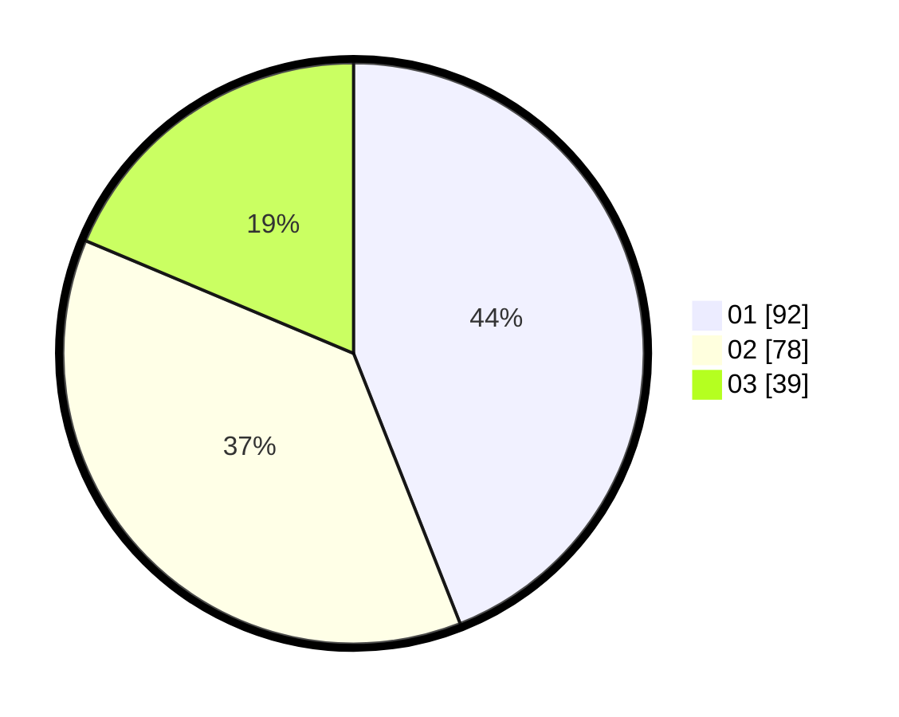

# Hasil

Hasil perolehan suara paslon dapat dilihat pada file paslon-01.txt, paslon-02.txt, dan paslon-03.txt.

Jika tidak ada, artinya data tersebut belum ada pada SIREKAP.

## Perolehan Suara

 * Paslon 01: **92**.
 * Paslon 02: **78**.
 * Paslon 03: **39**.

## Foto C Plano

https://sirekap-obj-formc.kpu.go.id/dd3a/pemilu/ppwp/31/71/03/10/07/3171031007048-20240217-172212--f71b6f9d-d6af-4628-9f5a-ea56d5cb5ee1.jpg

https://sirekap-obj-formc.kpu.go.id/dd3a/pemilu/ppwp/31/71/03/10/07/3171031007048-20240217-172214--f8bc8982-23bc-48cb-9249-3fdd4e4e38fe.jpg

https://sirekap-obj-formc.kpu.go.id/dd3a/pemilu/ppwp/31/71/03/10/07/3171031007048-20240217-172213--9410e678-bc12-4b37-bba1-95202ea91082.jpg

## DATA PEMILIH TETAP

Jumlah pemilih dalam DPT: **250**.
 * L: **120**.
 * P: **130**.

## DATA PENGGUNA HAK PILIH

Jumlah pengguna hak pilih dalam DPT: **207**.
 * L: **99**.
 * P: **108**.

Jumlah pengguna hak pilih dalam DPTb: **0**.
 * L: **0**.
 * P: **0**.

Jumlah pengguna hak pilih dalam DPK: **3**.
 * L: **2**.
 * P: **1**.

Jumlah pengguna hak pilih: **210**.
 * L: **101**.
 * P: **109**.

## JUMLAH SUARA SAH DAN TIDAK SAH

JUMLAH SELURUH SUARA SAH: **0**.

JUMLAH SUARA TIDAK SAH: **0**.

JUMLAH SELURUH SUARA SAH DAN SUARA TIDAK SAH: **0**.
