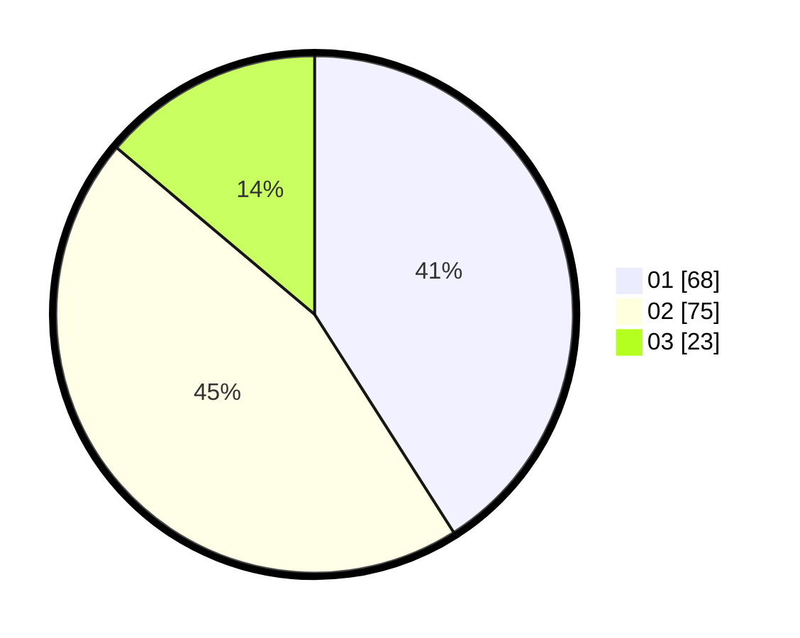

# Hasil

Hasil perolehan suara paslon dapat dilihat pada file paslon-01.txt, paslon-02.txt, dan paslon-03.txt.

Jika tidak ada, artinya data tersebut belum ada pada SIREKAP.

## Perolehan Suara

 * Paslon 01: **68**.
 * Paslon 02: **75**.
 * Paslon 03: **23**.

## Foto C Plano

https://sirekap-obj-formc.kpu.go.id/7627/pemilu/ppwp/31/71/03/10/07/3171031007050-20240216-140024--128b8909-12cd-471e-9018-25343a203cfb.jpg

https://sirekap-obj-formc.kpu.go.id/7627/pemilu/ppwp/31/71/03/10/07/3171031007050-20240216-140025--d8e935b5-3b2c-4fac-8e2a-b9840dfee550.jpg

https://sirekap-obj-formc.kpu.go.id/7627/pemilu/ppwp/31/71/03/10/07/3171031007050-20240216-140025--495c8aee-655a-4b2a-85db-521bd24f8901.jpg

## DATA PEMILIH TETAP

Jumlah pemilih dalam DPT: **242**.
 * L: **119**.
 * P: **123**.

## DATA PENGGUNA HAK PILIH

Jumlah pengguna hak pilih dalam DPT: **166**.
 * L: **80**.
 * P: **86**.

Jumlah pengguna hak pilih dalam DPTb: **8**.
 * L: **8**.
 * P: **0**.

Jumlah pengguna hak pilih dalam DPK: **0**.
 * L: **0**.
 * P: **0**.

Jumlah pengguna hak pilih: **174**.
 * L: **88**.
 * P: **86**.

## JUMLAH SUARA SAH DAN TIDAK SAH

JUMLAH SELURUH SUARA SAH: **166**.

JUMLAH SUARA TIDAK SAH: **8**.

JUMLAH SELURUH SUARA SAH DAN SUARA TIDAK SAH: **174**.
