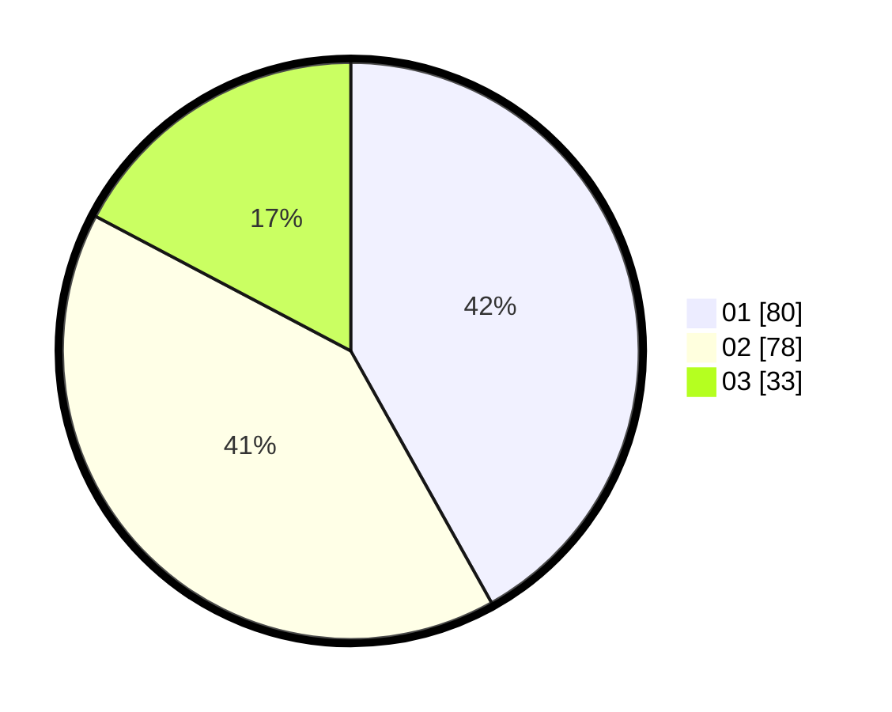

# Hasil

Hasil perolehan suara paslon dapat dilihat pada file paslon-01.txt, paslon-02.txt, dan paslon-03.txt.

Jika tidak ada, artinya data tersebut belum ada pada SIREKAP.

## Perolehan Suara

 * Paslon 01: **80**.
 * Paslon 02: **78**.
 * Paslon 03: **33**.

## Foto C Plano

https://sirekap-obj-formc.kpu.go.id/d46c/pemilu/ppwp/31/71/03/10/07/3171031007051-20240214-191618--e3924d93-9692-4dea-841b-65d0019d8da0.jpg

https://sirekap-obj-formc.kpu.go.id/d46c/pemilu/ppwp/31/71/03/10/07/3171031007051-20240214-191650--867415c1-421c-4bc7-a3b4-9e947bdab84b.jpg

https://sirekap-obj-formc.kpu.go.id/d46c/pemilu/ppwp/31/71/03/10/07/3171031007051-20240214-192036--bd26d749-ac90-45b9-b3b9-58fea77b1128.jpg

## DATA PEMILIH TETAP

Jumlah pemilih dalam DPT: **291**.
 * L: **137**.
 * P: **154**.

## DATA PENGGUNA HAK PILIH

Jumlah pengguna hak pilih dalam DPT: **184**.
 * L: **81**.
 * P: **103**.

Jumlah pengguna hak pilih dalam DPTb: **8**.
 * L: **2**.
 * P: **6**.

Jumlah pengguna hak pilih dalam DPK: **3**.
 * L: **1**.
 * P: **2**.

Jumlah pengguna hak pilih: **195**.
 * L: **84**.
 * P: **111**.

## JUMLAH SUARA SAH DAN TIDAK SAH

JUMLAH SELURUH SUARA SAH: **191**.

JUMLAH SUARA TIDAK SAH: **4**.

JUMLAH SELURUH SUARA SAH DAN SUARA TIDAK SAH: **195**.
