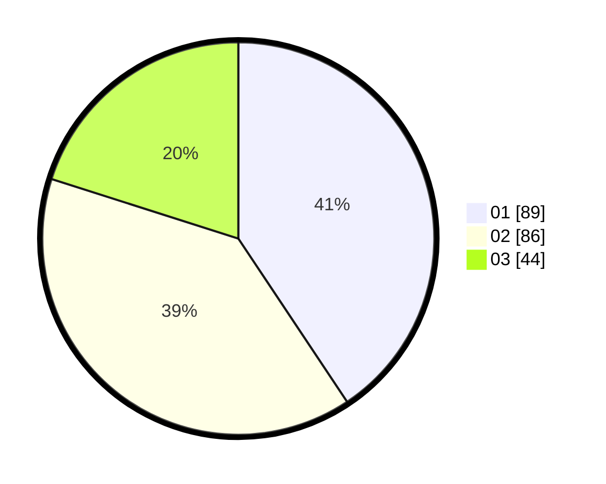

# Hasil

Hasil perolehan suara paslon dapat dilihat pada file paslon-01.txt, paslon-02.txt, dan paslon-03.txt.

Jika tidak ada, artinya data tersebut belum ada pada SIREKAP.

## Perolehan Suara

 * Paslon 01: **89**.
 * Paslon 02: **86**.
 * Paslon 03: **44**.

## Foto C Plano

https://sirekap-obj-formc.kpu.go.id/aac7/pemilu/ppwp/31/71/03/10/07/3171031007052-20240214-223428--a08907b2-3655-4575-bf5f-f4dc448afbfd.jpg

https://sirekap-obj-formc.kpu.go.id/aac7/pemilu/ppwp/31/71/03/10/07/3171031007052-20240214-203149--c661a1ab-e379-40af-9d63-02db9ba56da4.jpg

https://sirekap-obj-formc.kpu.go.id/aac7/pemilu/ppwp/31/71/03/10/07/3171031007052-20240214-203108--5052c3c6-7989-4235-99b9-0971069ee1fc.jpg

## DATA PEMILIH TETAP

Jumlah pemilih dalam DPT: **287**.
 * L: **127**.
 * P: **160**.

## DATA PENGGUNA HAK PILIH

Jumlah pengguna hak pilih dalam DPT: **210**.
 * L: **90**.
 * P: **120**.

Jumlah pengguna hak pilih dalam DPTb: **9**.
 * L: **5**.
 * P: **4**.

Jumlah pengguna hak pilih dalam DPK: **3**.
 * L: **2**.
 * P: **1**.

Jumlah pengguna hak pilih: **222**.
 * L: **97**.
 * P: **125**.

## JUMLAH SUARA SAH DAN TIDAK SAH

JUMLAH SELURUH SUARA SAH: **219**.

JUMLAH SUARA TIDAK SAH: **3**.

JUMLAH SELURUH SUARA SAH DAN SUARA TIDAK SAH: **222**.
