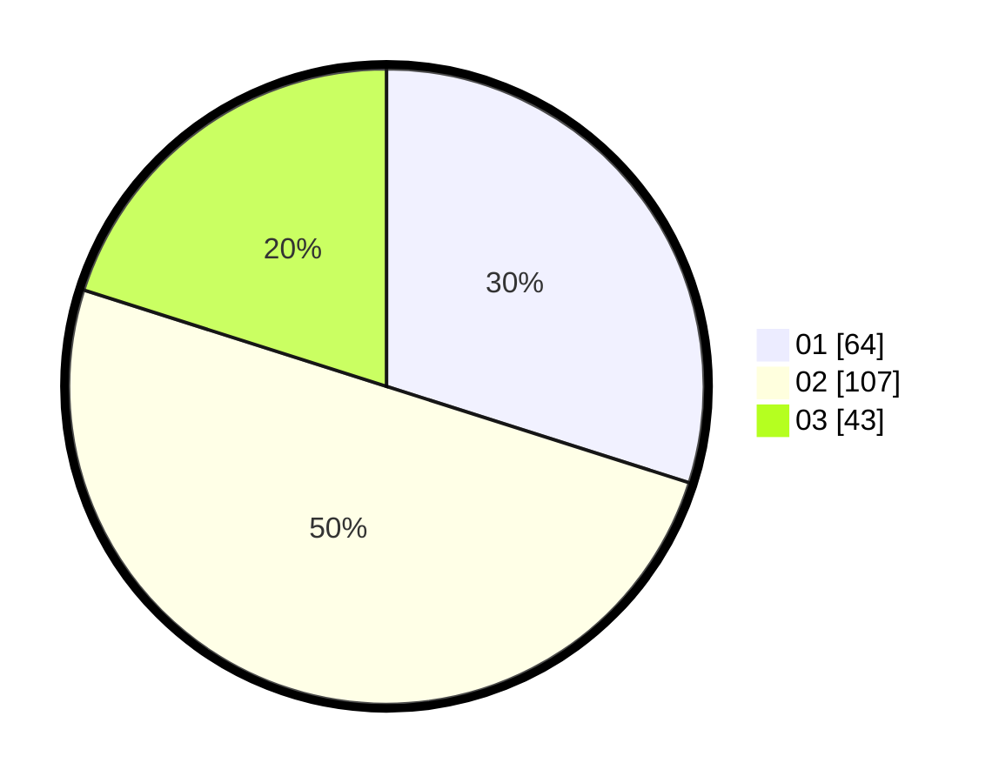

# Hasil

Hasil perolehan suara paslon dapat dilihat pada file paslon-01.txt, paslon-02.txt, dan paslon-03.txt.

Jika tidak ada, artinya data tersebut belum ada pada SIREKAP.

## Perolehan Suara

 * Paslon 01: **64**.
 * Paslon 02: **107**.
 * Paslon 03: **43**.

## Foto C Plano

https://sirekap-obj-formc.kpu.go.id/dcdf/pemilu/ppwp/31/71/03/10/07/3171031007053-20240217-054830--f8b88b5d-7514-4742-a3a7-99b9de33b5cf.jpg

https://sirekap-obj-formc.kpu.go.id/dcdf/pemilu/ppwp/31/71/03/10/07/3171031007053-20240217-054831--aab9796a-36b7-4f67-9f9b-76a4696ecdfa.jpg

https://sirekap-obj-formc.kpu.go.id/dcdf/pemilu/ppwp/31/71/03/10/07/3171031007053-20240217-054830--16f8fae2-dd77-45db-b19a-84d054b36a4c.jpg

## DATA PEMILIH TETAP

Jumlah pemilih dalam DPT: **287**.
 * L: **141**.
 * P: **146**.

## DATA PENGGUNA HAK PILIH

Jumlah pengguna hak pilih dalam DPT: **185**.
 * L: **86**.
 * P: **99**.

Jumlah pengguna hak pilih dalam DPTb: **18**.
 * L: **5**.
 * P: **13**.

Jumlah pengguna hak pilih dalam DPK: **13**.
 * L: **7**.
 * P: **6**.

Jumlah pengguna hak pilih: **216**.
 * L: **98**.
 * P: **118**.

## JUMLAH SUARA SAH DAN TIDAK SAH

JUMLAH SELURUH SUARA SAH: **214**.

JUMLAH SUARA TIDAK SAH: **2**.

JUMLAH SELURUH SUARA SAH DAN SUARA TIDAK SAH: **216**.
