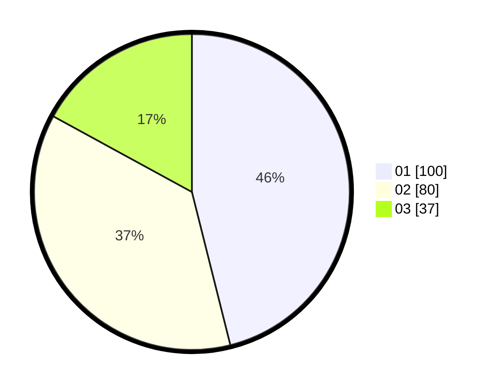

# Hasil

Hasil perolehan suara paslon dapat dilihat pada file paslon-01.txt, paslon-02.txt, dan paslon-03.txt.

Jika tidak ada, artinya data tersebut belum ada pada SIREKAP.

## Perolehan Suara

 * Paslon 01: **100**.
 * Paslon 02: **80**.
 * Paslon 03: **37**.

## Foto C Plano

https://sirekap-obj-formc.kpu.go.id/fea7/pemilu/ppwp/31/71/03/10/07/3171031007055-20240216-163529--d3778bd7-1fac-43d9-8ca1-04c49e8b2d3d.jpg

https://sirekap-obj-formc.kpu.go.id/fea7/pemilu/ppwp/31/71/03/10/07/3171031007055-20240216-163530--9b859320-91ff-41fc-9dce-fab6f0e4f8c2.jpg

https://sirekap-obj-formc.kpu.go.id/fea7/pemilu/ppwp/31/71/03/10/07/3171031007055-20240216-163530--20f1878f-8686-48e5-9321-b4a7c0f4b5da.jpg

## DATA PEMILIH TETAP

Jumlah pemilih dalam DPT: **274**.
 * L: **126**.
 * P: **148**.

## DATA PENGGUNA HAK PILIH

Jumlah pengguna hak pilih dalam DPT: **211**.
 * L: **95**.
 * P: **116**.

Jumlah pengguna hak pilih dalam DPTb: **7**.
 * L: **4**.
 * P: **3**.

Jumlah pengguna hak pilih dalam DPK: **1**.
 * L: **0**.
 * P: **1**.

Jumlah pengguna hak pilih: **219**.
 * L: **99**.
 * P: **120**.

## JUMLAH SUARA SAH DAN TIDAK SAH

JUMLAH SELURUH SUARA SAH: **217**.

JUMLAH SUARA TIDAK SAH: **2**.

JUMLAH SELURUH SUARA SAH DAN SUARA TIDAK SAH: **219**.
